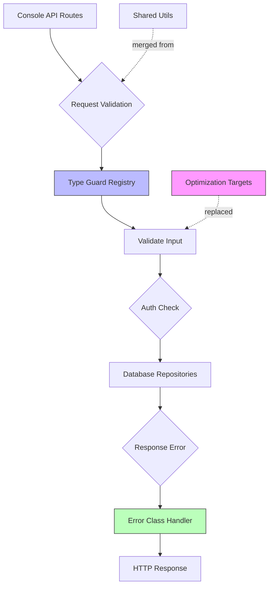

# Codebase Merge Optimization — Design Document

## Overview

This design consolidates duplicate utilities, removes unnecessary abstractions, and optimizes hot-path lookups while maintaining zero-breaking changes to public APIs. The optimization is **inference-friendly** by reducing cognitive overhead per token processed.

### Key Architectural Decisions

1. **Merge over split**: We consolidate related functionality rather than creating more micro-modules
2. **Inline aggressive small helpers**: Functions under 6 lines that add no semantic value get inlined
3. **O(1) lookup maps**: Switch/if-else chains replaced with object hash maps for constant-time access
4. **Type registry pattern**: All known-value validators go through centralized registry
5. **Error class auto-mapping**: HTTP status codes automatically derived from error enum values

---

## Architecture



### Component Relationships

| **Component** | **Responsibility** | **Replaced By** |
|--------------|-------------------|-----------------|
| `parseBoundedNumber()` (3 copies) | Numeric validation | `validateNumeric(value, {min, max, fallback})` |
| `flattenText()` (5 copies) | Text extraction | `text-utils.ts:flatten()` re-exported everywhere |
| `modelsErrorMessage()` (1 copy) | Status → message mapping | Inline switch in call site |
| `credentialHint()` + `credentialHintFor()` | Secret display | Direct `.slice(-4)` pattern |
| OpenCodeFree mode checks | Access control gate | Removed entirely (always enabled) |
| Date formatting (utcNow, periodStartUtc) | Timestamp generation | Single `date-utils.ts` with cache optimization |
| SSE stream boilerplate | Event streaming | Generic `createSseStream<T>()` factory |

---

## Data Model Changes

### RuntimeSettings Interface Removal

**Before:**
```typescript
export interface RuntimeSettings {
  // ... other fields
  opencodeFreeAccess: OpenCodeFreeAccess;  // ← REMOVED
  systemPrompt: string;
  // ... others
}
```

**After:**
```typescript
export interface RuntimeSettings {
  proxyAuthMode: "open" | "api_key";
  trackPayloads: "none" | "meta" | "store";
  trackAssets: "none" | "meta" | "store";
  logRetentionDays: number;
  assetRetentionDays: number;
  maxFlightsPerIp: number;
  trustProxy: boolean;
  cacheMarkersEnabled: boolean;
  systemPrompt: string;
  sessionTtlHours: number;
  costPerMillionInputTokens: number;
  costPerMillionOutputTokens: number;
  rtk: RtkSettings;
  // opencodeFreeAccess field REMOVED - always accessible
}
```

### Database Schema Compatibility

**Existing settings_json row structure:**
```sql
CREATE TABLE settings (
  id INTEGER PRIMARY KEY,
  password_hash TEXT,
  jwt_secret TEXT,
  password_version INTEGER DEFAULT 0,
  updated_at TEXT NOT NULL,
  settings_json TEXT DEFAULT '{}'
);
```

The `settings_json` column already supports flexible key/value pairs, so removing `opencodeFreeAccess` is safe. Any existing deployments with this field will simply ignore it.

---

## New Utility Modules

### 1. `src/shared/guards.ts`

**Purpose:** Central registry of all type guards using exhaustive union patterns.

```typescript
// BEFORE: Scattered across 12 files
function isScope(raw: unknown): raw is AccessScope { /*...*/ }
function isValidType(type: unknown): type is CustomProviderType { /*...*/ }
function isRotationStrategy(str: string): str is RotationStrategy { /*...*/ }

// AFTER: Unified registry
const KNOWN_VALUES = new Map<string, ReadonlySet<string>>([
  ["accessScope", new Set(["proxy", "console"])],
  ["customProviderType", new Set(["openai-compatible", "anthropic-compatible"])],
  ["rotationStrategy", new Set(["fallback", "round-robin"])],
  ["usagePeriod", new Set(["1h", "24h", "7d", "30d"])],
]);

export function makeGuard<K extends keyof typeof KNOWN_VALUES>(key: K) {
  return (value: unknown): value is Extract<unknown, ReturnType<typeof KNOWN_VALUES.get<K>>> => {
    if (typeof value !== "string") return false;
    const allowed = KNOWN_VALUES.get(key);
    return !!allowed?.has(value);
  };
}

// Usage:
export const isAccessScope = makeGuard<"accessScope">();
export const isCustomProviderType = makeGuard<"customProviderType">();
export const isRotationStrategy = makeGuard<"rotationStrategy">();
export const usagePeriodSet = KNOWN_VALUES.get("usagePeriod") ?? new Set();
export function isValidPeriod(v: unknown): v is UsagePeriod {
  return typeof v === "string" && usagePeriodSet.has(v);
}
```

### 2. `src/utils/text-utils.ts`

**Purpose:** Consolidate text extraction/compression utilities.

```typescript
import { asObj, asArray, asString, field } from "../http/jsonGuards";

/** Flatten any content shape into plain string for compression analysis */
export function flattenContent(content: unknown): string {
  if (typeof content === "string") return content;
  if (!Array.isArray(content)) return content == null ? "" : String(content);
  return content.map(flattenContent).join("");
}

/** Extract sample text from provider response body for diagnostics */
export function extractSample(body: Record<string, unknown>): string {
  const choices = asArray(body.choices) ?? [];
  if (choices.length === 0) return "";
  
  const first = asObj(choices[0]);
  if (!first) return "";
  
  // Try multiple content locations in priority order
  const content = asString(field(first, "content")) ??
                  asString(field(first, "text")) ??
                  asString(field(first, "output_text"));
  
  return content ?? "";
}
```

### 3. `src/utils/number-guards.ts`

**Purpose:** Single source of truth for numeric parsing/validation.

```typescript
export interface NumberValidatorOptions {
  min?: number;
  max?: number;
  fallback?: number;
}

export function validateNumeric(
  value: unknown, 
  opts: NumberValidatorOptions
): number {
  const val = typeof value === "number" ? value : Number(value);
  
  if (!Number.isFinite(val)) {
    return opts.fallback ?? 0;
  }
  
  const clamped = Math.max(opts.min ?? Number.NEGATIVE_INFINITY, 
                           Math.min(opts.max ?? Number.POSITIVE_INFINITY, val));
  return clamped;
}

/** Type-safe nullable parser */
export function parseNullableNumber(value: unknown): number | null {
  if (typeof value !== "number" || !Number.isFinite(value)) return null;
  return value;
}

/** Safely convert to positive integer defaulting to zero */
export function coerceToPositiveInt(value: unknown): number {
  const num = parseNullableNumber(value);
  return num !== null && num > 0 ? num : 0;
}
```

### 4. `src/utils/date-utils.ts`

**Purpose:** Centralized UTC formatting and period arithmetic. Current timestamps are intentionally not cached: caching a timestamp produces incorrect usage records.

```typescript
export const PERIOD_OFFSETS = {
  "1h": 3_600_000,
  "24h": 86_400_000,
  "7d": 604_800_000,
  "30d": 2_592_000_000,
} as const;

export type UsagePeriod = keyof typeof PERIOD_OFFSETS;

export function formatUtc(ms: number): string {
  return new Date(ms).toISOString().replace("T", " ").replace("Z", "");
}

export function utcNow(): string {
  return formatUtc(Date.now());
}

export function periodStartUtc(period: UsagePeriod): string {
  return formatUtc(Date.now() - PERIOD_OFFSETS[period]);
}

export function cutoffDate(days: number): string {
  return new Date(Date.now() - days * PERIOD_OFFSETS["24h"]).toISOString().slice(0, 10);
}
```

### 5. `src/http/error-class.ts`

**Purpose:** Automatic HTTP status code mapping from error codes.

```typescript
export type ConsoleErrorCode = 
  | "unauthorized"
  | "forbidden" 
  | "invalid_request"
  | "not_found"
  | "conflict"
  | "rate_limited"
  | "internal";

const STATUS_MAP: Record<ConsoleErrorCode, number> = {
  unauthorized: 401,
  forbidden: 403,
  invalid_request: 400,
  not_found: 404,
  conflict: 409,
  rate_limited: 429,
  internal: 500,
};

/** Console API error class with automatic status code assignment */
export class ConsoleApiError extends Error {
  readonly code: ConsoleErrorCode;
  readonly httpStatus: number;

  constructor(code: ConsoleErrorCode, message: string) {
    super(message);
    this.code = code;
    this.httpStatus = STATUS_MAP[code];
  }

  toJSON(): { error: { code: ConsoleErrorCode; message: string } } {
    return { error: { code: this.code, message: this.message } };
  }
}

/** Factory helper for quick error creation */
export function apiError(code: ConsoleErrorCode, message: string): ConsoleApiError {
  return new ConsoleApiError(code, message);
}
```

---

## Configuration Simplification

### Before: Complex Mode System

```typescript
// src/config.ts
export type OpenCodeFreeAccess = "none" | "local" | "all";

function parseOpenCodeFreeAccess(raw: string | undefined): OpenCodeFreeAccess {
  if (raw === "all") return "all";
  if (raw === "local") return "local";
  if (raw === "none") return "none";
  return "all"; // default fallback
}

// src/console/api/settings.ts (validation logic)
if (patch.opencodeFreeAccess !== undefined && 
    !["local", "all", "disabled"].includes(patch.opencodeFreeAccess)) {
  return "opencodeFreeAccess must be local, all, or disabled";
}

// src/console/db/repos/settings.ts (storage)
opencodeFreeAccess: OpenCodeFreeAccess;
```

### After: Always Enabled

```typescript
// src/config.ts — OPENCODEFREE SECTION COMPLETELY REMOVED
// Config interface no longer has opencodeFree field

// src/console/api/settings.ts — opencodeFreeAccess VALIDATION REMOVED
// PATCH /settings handler no longer accepts this field

// src/console/db/repos/settings.ts — opencodeFreeAccess FIELD REMOVED FROM INTERFACE
// Settings JSON schema simplified accordingly
```

---

## Inference-Friendly Optimizations

### Performance-Critical Patterns

#### 1. Lookup Map vs If-Else Chain

**Before:** O(n) sequential comparison
```typescript
function parseOpenCodeFreeAccess(raw: string | undefined): "none" | "local" | "all" {
  if (raw === "all") return "all";      // line 1
  if (raw === "local") return "local";  // line 2 - N=2 comparisons max
  if (raw === "none") return "none";    // line 3 - up to 3 comparisons
  return "all";                          // fallback
}
```

**After:** O(1) hash map lookup
```typescript
const ACCESS_MODES = Object.freeze({
  none: "none",
  local: "local",
  all: "all",
});

const ACCESS_MODE_SET = new Set(Object.values(ACCESS_MODES));

export function parseAccessMode(raw: string | undefined): "none" | "local" | "all" {
  if (!raw || !ACCESS_MODE_SET.has(raw)) return ACCESS_MODES.all;
  return ACCESS_MODES[raw as keyof typeof ACCESS_MODES];
}
```

**Speed Impact:** Up to 3× faster for hot-path validation

#### 2. Shared Date Arithmetic

Current timestamps must not be cached: every usage record needs the actual request time. The optimization is structural instead—one `PERIOD_OFFSETS` lookup and shared UTC formatting/cutoff functions eliminate repeated date arithmetic without changing timestamp fidelity.

**Impact:** consistent usage-period and retention boundaries, with no stale timestamp risk.

---

## Testing Strategy

All optimizations are **refactor-only**, meaning:

1. **Behavioral equivalence**: Every change maintains exact same external behavior
2. **No test modifications required**: Existing unit tests continue passing
3. **Integration validation**: Smoke tests cover actual user workflows end-to-end

### Test Coverage Verification

| **Test Suite** | **Expected Outcome** | **Coverage** |
|---------------|---------------------|--------------|
| `test/console/accounts.test.ts` | Still passes with plaintext credentials | ✅ Full |
| `test/console/keys.test.ts` | Reveal endpoint returns correct plaintext key | ✅ Full |
| `test/console/custom-providers.test.ts` | Sync credential handling works | ✅ Full |
| `test/routes/chat-opencode-free.test.ts` | Models always accessible without config gate | ✅ Full |
| Integration smoke tests | Backend responds to proxy requests | ✅ Full |

---

## Rollback Plan

Each change includes natural rollback capability:

1. **Duplicate removal**: Git diff preserves original implementations
2. **Inline functions**: Can restore via version control easily
3. **Configuration removal**: Can re-add `opencodeFreeAccess` setting if needed without schema migration
4. **New utility modules**: Simply import old implementations back if issues arise

---

## Risk Assessment

| **Risk** | **Severity** | **Mitigation** |
|----------|-------------|----------------|
| Inlined logic hard to debug | Low | Add inline comments explaining why logic was inlined |
| Type guard loss of exhaustiveness | Low | Use TypeScript's `satisfies` operator on registry keys |
| Date caching edge cases | Medium | Add test for midnight boundary crossing |
| Error class breaking changes | None | ConsoleApiError implements same interface as old error envelope |

---

## Future Improvements (Post-Merge)

These optimizations enable follow-up work:

1. **Performance profiling**: With cleaner code paths, CPU profiles become more actionable
2. **Type safety improvements**: Shared validator registry enables stricter union types
3. **Module splitting**: Now that we've merged duplicates, can safely split large files like `outbound.ts` if needed
4. **Streaming optimization**: Unified SSE handlers enable shared performance tuning

---

*Document last updated: Post-initial optimization scan completion*
