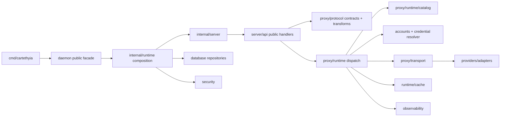

# Feature Design

## Overview

This design defines a conservative daemon cleanup based on `docs/daemon-core-cleanup-audit.md`.

The design optimizes four things:

```text
1. duplicate authority;
2. duplicate request orchestration;
3. unnecessary package/import fan-out;
4. measured hot-path allocations and contention.
```

It explicitly does **not** optimize for an arbitrary file or package count. A large cohesive Go file is acceptable. A smaller tree is useful only when it removes a real duplicate authority, makes a shared lifecycle explicit, or reduces dependency/build invalidation cost.

The current daemon has approximately 60 Go packages. The conservative target is approximately 40–42 packages after migration, with the exact final count measured by `go list ./...`. The target is not a hard acceptance number and must not justify deleting functionality or valid boundaries.

## Design principles

### Preserve semantic owners

The following boundaries remain independent:

```text
application composition and lifecycle
accounts and credential lifecycle
account drivers
database persistence
database backup
database migrations
observability and usage
providers and provider adapters
proxy runtime and routing
proxy catalog
proxy protocol and transforms
compatibility planning/corpus
outbound transport
cache
security capture/outbound policy
HTTP server/public API/admin API/middleware
```

### One authority per behavior

A behavior SHALL have one owner. Compatibility aliases, wrappers, and duplicate orchestration are migrated away when references reach zero.

### File size is not a design boundary

File splitting is allowed when it isolates a state machine, lifecycle, or dependency direction. File merging is preferred when multiple tiny files form one owner and do not create a giant mixed concern.

### Measure runtime changes

A package move or file merge is not a performance claim. Runtime optimization requires a baseline and an appropriate benchmark/profile.

## Current-to-target architecture



The target retains this flow. Cleanup changes ownership/path clarity; it does not replace the canonical request lifecycle.

## Target ownership and package decisions

### Retain as independent packages

| Package | Responsibility | Reason to retain |
|---|---|---|
| `internal/runtime` | composition, lifecycle, diagnostics, dependency wiring | concrete composition root and process lifecycle |
| `internal/accounts` | account, secret, reference, refresh contracts | credential safety and lifecycle |
| `internal/accounts/drivers` | concrete auth drivers and registry | provider-specific auth implementation boundary |
| `internal/accounts/flow` | callback/session auth flow | independent OAuth/session flow |
| `internal/config` | environment/config validation | configuration boundary |
| `internal/database` | database client/runtime | persistence owner |
| `internal/database/models` | persistence models | retain during first cleanup; broad migration is deferred |
| `internal/database/repositories` | repository implementations | persistence adapter boundary |
| `internal/database/backup` | scheduled backup/restore | independent lifecycle and security workflow |
| `internal/database/migrations` | schema migration | ordered schema lifecycle |
| `internal/observability` | bounded events/evidence/metrics | cross-cutting but one bounded schema owner |
| `internal/observability/usage` | token/price ledger | independent accounting lifecycle |
| `internal/providers` | provider metadata/capability/registry | shared provider catalog owner |
| `internal/providers/adapters` | provider request adaptation | outbound/provider-specific boundary |
| `internal/providers/apikey` | API-key provider definitions | static provider catalog; no runtime gain from flattening |
| `internal/providers/builtin` | builtin/custom materialization | provider catalog lifecycle |
| `internal/providers/oauth` | OAuth provider definitions | auth-specific provider boundary |
| `internal/providers/policies` | provider policies | policy owner |
| `internal/proxy/runtime` | router, pool, dispatch, stream, readiness | request-path state machines |
| `internal/proxy/runtime/catalog` | refreshable model route snapshots | catalog lifecycle distinct from attempts |
| `internal/proxy/control/*` | admission, prompt cache, continuation, token budget | shared by runtime, server, providers, or persistence; not all are runtime-only |
| `internal/proxy/protocol/contracts` | shared protocol/domain vocabulary | intentionally high fan-in |
| `internal/proxy/protocol/transforms` | codecs, canonical model, normalization, projection | wire/semantic boundary |
| `internal/proxy/protocol/compatibility` | compatibility policy/plans | feature capability owner |
| `internal/proxy/protocol/compatibility/corpus` | acceptance corpus/scoring | offline acceptance boundary |
| `internal/proxy/transport` | outbound HTTP/SSE | network execution boundary |
| `internal/runtime/cache` | memory/Redis/router/content/response cache | shared infrastructure and concurrency boundary |
| `internal/security/capture` | capture prevention/store | security boundary |
| `internal/security/outbound` | outbound network policy | security boundary |
| `internal/server` | HTTP listener/router/share | server lifecycle |
| `internal/server/admin` | admin routes/services/auth | distinct authorization/mutation surface |
| `internal/server/middleware` | HTTP cross-cutting concerns | request boundary |

### Consolidate package scaffolding

#### Proxy alias authority

Current:

```text
internal/proxy/proxy.go        # aliases internal/proxy/runtime
internal/proxy/runtime/*.go   # actual implementation, package name proxy
```

Target:

```text
internal/proxy/runtime/*.go   # sole implementation authority
```

Migration order:

1. run symbol-aware references for all aliases exported by `internal/proxy/proxy.go`;
2. migrate callers to `internal/proxy/runtime`;
3. run package/build/reference checks;
4. delete `internal/proxy/proxy.go` only when production references are zero.

No alias or compatibility shim is retained after cutover.

#### Public API package

Current API package fragmentation:

```text
internal/server/api/contracts
internal/server/api/errors
internal/server/api/v1
internal/server/api/v1/action
internal/server/api/v1/chat
internal/server/api/v1/gemini
internal/server/api/v1/images
internal/server/api/v1/messages
internal/server/api/v1/models
internal/server/api/v1/responses
internal/server/api/wire
```

Target:

```text
internal/server/api
```

Target file owners:

```text
v1.go              registration and shared API dependencies
action.go          action endpoint
chat.go            OpenAI Chat endpoint
messages.go        Anthropic Messages endpoint and token counting
responses.go       OpenAI Responses endpoint
gemini.go          Gemini endpoint
images.go         image endpoint
models.go         models endpoint
wire.go           wire response and body helpers
deadlines.go      API deadline helpers
response_headers.go shared response header helpers

The lower-level shared owners remain separate to avoid an import cycle with
middleware:

```text
internal/server/apicontracts/contracts.go
internal/server/apierrors/errors.go
```

`server/api` imports those lower-level owners; middleware may import the
lower-level contracts/errors without importing the endpoint package.
```

The package consolidation does not mean protocol behavior is unified. It means HTTP lifecycle orchestration has one owner while each endpoint continues to select the correct protocol codec and surface-specific projection.

#### Account driver package

Current:

```text
internal/accounts/drivers/anthropic
internal/accounts/drivers/antigravity
internal/accounts/drivers/cline
internal/accounts/drivers/codex
internal/accounts/drivers/grokbuild
internal/accounts/drivers/kimchi
internal/accounts/drivers/kiro
```

Target:

```text
internal/accounts/drivers/*.go
```

Each driver remains a distinct type/constructor and registry entry. Only nested package scaffolding is removed. Driver-specific auth headers, token parsing, endpoint logic, refresh rules, and error classification remain separate functions or types.

#### Account contract/store wrappers

The single-file `accounts/contract` and `accounts/store` packages are merged into the `accounts` owner. Their interfaces and implementations remain; only package boundaries change.

## Proxy request lifecycle design

### Dispatch

`internal/proxy/runtime/service.go` remains the dispatch authority. It owns the sequence:

```text
validate request
→ build metadata
→ resolve catalog/route plan
→ validate continuation
→ attempt response-cache lookup
→ acquire admission
→ stream or non-stream route
→ validate provider result
→ project canonical response
→ record usage/continuation
→ finalize bounded metadata
```

No new generic service layer is introduced. File-level extraction is optional and only used if it makes this sequence or side effects easier to test without adding package edges.

### Router

`internal/proxy/runtime/router.go` remains the route authority. Its state machine preserves:

```text
account exclusions
candidate readiness
credential preparation
attempt reservation
refresh retry
compatibility repair
provider attempt
failure classification
model/account scope updates
hedging
availability wait
bounded evidence
```

A small shared internal attempt state MAY be introduced for duplicated transitions:

```go
type attemptState struct {
    attempted      []map[string]struct{}
    memberRequests []contracts.Request
    refreshes      map[string]int
    refreshBudget  int
    bestFailure    *Failure
    availability   Availability
}
```

This state is not an exported package contract. It MUST NOT hide stream-specific terminal behavior.

### Stream

`Stream`, `StreamBridge`, preflight, cancellation, and finalization remain owned by `internal/proxy/runtime`.

The stream contract remains:

```text
provider stream acquisition
→ preflight acceptance
→ downstream event projection
→ terminal event exactly once
→ upstream close/cancellation
→ usage reconciliation
→ bounded finalization evidence
```

The existing compatibility bridge is not deleted as part of package cleanup. It is migrated only after codec-first callers exist and references are verified.

## Protocol design

`internal/proxy/protocol/contracts` and `internal/proxy/protocol/transforms` remain separate.

### Shared semantic layer

The canonical model retains:

```text
presence/optional semantics
messages/content blocks
media/audio/file/document/PDF references
tools and tool occurrences
structured output
reasoning
compaction
context management
usage
normalized response/events
bounded validation
native sidecar
```

An 800–1200 line canonical file is acceptable if it remains one semantic owner. Split only when profiling or dependency analysis shows a measurable benefit or independent lifecycle; do not split solely by type count.

### Surface-specific codec layer

The following remain distinct:

```text
OpenAI Chat
OpenAI Responses
Anthropic Messages
Gemini
```

Shared helpers MAY cover bounded JSON values, canonical construction, validation, registry lookup, and sidecar policy. Surface-specific event names, tool envelopes, media envelopes, reasoning formats, finish semantics, and response projection remain owned by each codec.

## Cache design

`internal/runtime/cache` remains the cache owner during this specification.

The following implementations remain separate:

```text
Memory
Redis
Router/fallback
ResponseCache
SharedContentStore
```

They share the `Cache`, `Entry`, `Key`, generation, invalidation, and coalescing contracts but not implementation internals.

Performance measurement points:

```text
Memory.Get hit/miss
Memory.GetOrLoad coalescing
key/fingerprint creation
Redis remote hit/miss/failure
Router fallback
response-cache hit/miss
content envelope storage
```

Correctness invariants have priority over copy/lock micro-optimization.

## Provider and database design

### Providers

Provider definition files remain separate. Static catalog file count is not a request-path performance issue. Shared helper duplication is removed only when it is actually duplicated and semantically provider-neutral.

### Database

The first cleanup retains:

```text
database/models
database/repositories
database/backup
database/migrations
```

A later domain-model migration MAY introduce account/provider/network-owned domain values and database mapping files, but it is explicitly outside the first package consolidation slice. This avoids turning cleanup into a broad persistence rewrite.

## Import direction

```text
cmd/cartethyia
    → daemon public API and offline operator seams

internal/runtime
    → concrete composition graph

internal/server
    → runtime ports, protocol contracts/transforms, middleware/admin
    ✗ database implementation in public request handlers

internal/proxy/runtime
    → protocol, catalog, controls, provider ports, cache, observability
    ✗ server handlers and application composition

internal/proxy/protocol/transforms
    → contracts and standard library
    ✗ database, server, transport, provider HTTP

internal/providers
    → provider metadata/capabilities/adapters and protocol vocabulary
    ✗ server request lifecycle

internal/database
    → SQL/Bun and persistence models/repositories
    ✗ protocol codec and retry policy
```

Composition-root import count is not minimized cosmetically. Concrete wiring remains visible in `internal/runtime`.

## Performance design and measurement

### Baselines

Before changing request-path code, record:

```text
router ordinary success
router one retry
router exhaustion
stream preflight
protocol decode/normalize/encode
response cache hit
response cache miss
memory cache hit/miss/coalescing
stream frame encoding
```

Collect:

```text
ns/op
allocs/op
bytes/op
CPU profile for representative local load
mutex/block profile when contention is suspected
```

### Stream frame optimization

Only if profiles identify dynamic frame construction as material:

```text
- replace stable dynamic maps with typed small frame values;
- reuse bounded buffers only under explicit ownership;
- avoid cross-goroutine scratch reuse;
- retain exact event and terminal wire shape.
```

### Protocol conversion optimization

Only if profiles identify repeated conversion:

```text
- define byte/slice ownership explicitly;
- eliminate only redundant copies;
- preserve canonical isolation and native sidecar safety;
- rerun differential/corpus/fuzz coverage.
```

### Router dedupe optimization

Only identical transitions may be shared. A callback-heavy generic attempt engine is rejected if it obscures stream acceptance or increases allocations/indirection.

### Cache optimization

Only measured lock/copy/serialization costs may be optimized. Cache close, single-flight, tenant scope, generation, and zero-provider-call hit behavior are non-negotiable.

## Error handling

- Moved symbol errors SHALL fail at compile time and be resolved through caller migration.
- Package consolidation errors SHALL preserve typed API/proxy/protocol error mapping.
- Compatibility failures SHALL remain typed capability/translation errors.
- Cache backend failures SHALL retain typed miss, closed, generation mismatch, coordination, fallback, and remote error distinctions.
- Stream preflight failure SHALL remain distinguishable from post-acceptance terminal failure.
- Migration SHALL not convert recoverable provider failures into generic internal errors.

## Testing and verification strategy

The implementation task list SHALL use existing tests and add coverage only for new observable contracts.

Required gates for each bounded migration:

```powershell
go test ./...
go build ./...
go vet ./...

$env:CGO_ENABLED = '1'
$env:CC = 'C:\Users\Aria\Tools\llvm-mingw-20260616-ucrt-x86_64\bin\gcc.exe'
go test -race ./...

go run ./cmd/cartethyia compat matrix --corpus testdata/compatibility --json
```

Required behavioral proof:

```text
- all public endpoint routes remain registered;
- all provider/account driver registrations remain present;
- proxy alias removal has zero stale references;
- ordinary route success does not add provider calls;
- retries, refresh, repair, hedge, and exhaustion remain bounded;
- stream terminal/cancellation/finalization remains correct;
- cache hit performs zero provider calls;
- cache coalescing and close remain race-free;
- protocol differential/corpus behavior remains equivalent;
- no raw provider response bypass appears;
- benchmark claims include before/after metrics.
```

## Rollback strategy

Each migration phase is independently revertible:

1. alias/caller migration;
2. account driver package flattening;
3. public API package flattening;
4. measured router/stream/cache/protocol optimization.

No phase may combine unrelated provider, database, protocol, and routing behavior changes in one unreviewable migration.
