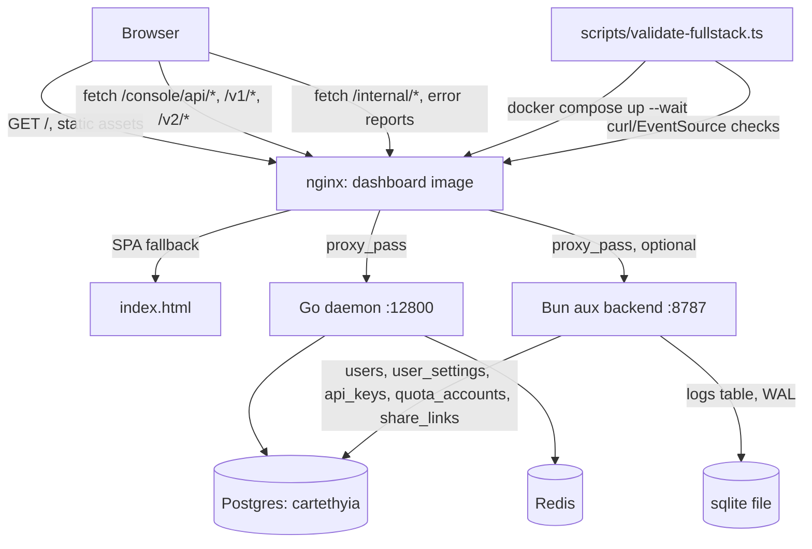

# Design Document

## Overview

Four workstreams, deliberately independent of each other so they can run as
parallel subagent tasks, converging on one final validation pass:

| # | Workstream | Touches | Depends on |
|---|---|---|---|
| 1 | Bun auxiliary backend (`postgres.ts`/`sqlite.ts` wiring) | `dashboard/src/server/*`, `dashboard/src/lib/error-reporter.ts`, `dashboard/package.json` | nothing |
| 2 | Dashboard nginx Docker wiring | `docker/nginx.conf` (new), `Dockerfile`, `docker-compose.yml` | nothing |
| 3 | Daemon coverage hardening (`database`, `providers` root) | `daemon/internal/database/*_test.go`, `daemon/internal/providers/*_test.go` | nothing |
| 4 | Full-stack validation harness | `scripts/validate-fullstack.ts` (new) | consumes what 1+2 produce, but the *script itself* can be written in parallel — it only needs to actually *run* after 1+2 land |

None of 1/2/3 write to a file another one touches. 4 writes a new script that
*calls* the services 1 and 2 stand up, so it can be authored in parallel and
only needs 1+2's artifacts to exist at run time, not at write time.

## Architecture



Same-origin stays intact end to end: the browser only ever talks to the
`dashboard` nginx origin. Nginx is the single fan-out point to the daemon and
(optionally) the aux backend — this matches the existing `api.ts` "same-origin
fetch" design instead of introducing CORS.

## Components and Interfaces

### 1. Bun auxiliary backend

**Location**: `dashboard/src/server/index.ts` (new). Lives under `src/` so it
reuses the existing `tsconfig.json` (`include: ["src", "test", ...]`) — no
second tsconfig, no second `tsc --noEmit` pass. It is never bundled by Vite
because nothing reachable from `main.tsx` imports `src/server/*` (same
tree-shaking guarantee already proven for `lib/postgres.ts`/`sqlite.ts`).

```typescript
// dashboard/src/server/index.ts
import { getPgPool } from "../lib/postgres";
import { runMigrations } from "../lib/migrations";
import { getSqliteLogPool, type LogInsert, type LogLevel } from "../lib/sqlite";

const PORT = Number(process.env.CARTETHYIA_DASHBOARD_SERVER_PORT ?? 8787);
const pool = getPgPool({ connectionString: process.env.CARTETHYIA_DASHBOARD_DATABASE_URL });
await runMigrations(pool, { directory: "dashboard/migrations" });
const sqlite = getSqliteLogPool({ filename: process.env.CARTETHYIA_DASHBOARD_SQLITE_PATH ?? "data/logs.db" });

Bun.serve({ port: PORT, fetch: handleRequest });
```

**Routes** (`dashboard/src/server/routes.ts`, minimal hand-rolled router, no
framework dependency):

| Method | Path | Body / Query | Response |
|---|---|---|---|
| `GET` | `/internal/health` | — | `{ postgres: "ok"\|"error", migrations: MigrationStatus, sqlite: SqliteLogStats }` |
| `POST` | `/internal/logs` | `LogInsert` JSON | `201` on success, `400` on invalid `level` |
| `GET` | `/internal/logs` | `?level=&limit=` | `LogRow[]` from `readLogs` |

Both Postgres and SQLite calls go through the already-built, already-tested
`postgres.ts`/`sqlite.ts`/`migrations.ts` handles verbatim — this component
is a thin HTTP shell around code that already exists, not new business
logic. It does **not** implement user/session/settings CRUD — Requirement 1
only asks for migrations applying cleanly, the sqlite pool initializing, and
a log ingestion/read path proving the plumbing works end to end. Full
multi-user CRUD over `users`/`user_settings`/`api_keys`/`share_links` is out
of scope here (flagged as a future spec if the audit-layer direction is
confirmed).

**Frontend side**: `dashboard/src/lib/error-reporter.ts` (new):

```typescript
export function reportError(level: LogLevel, message: string, context?: Record<string, unknown>): void {
  void fetch("/internal/logs", {
    method: "POST",
    headers: { "content-type": "application/json" },
    body: JSON.stringify({ level, message, context }),
  }).catch(() => undefined); // fire-and-forget; never blocks or throws
}
```

Wired into `main.tsx` with two global listeners (`window.addEventListener("error", ...)`
and `("unhandledrejection", ...)`) — no per-call-site instrumentation, matching
"absolute minimal code."

**package.json**: add `"server": "bun run src/server/index.ts"` script.

### 2. Dashboard nginx Docker wiring

**Location**: `docker/nginx.conf` (new), referenced from the `dashboard`
stage in `Dockerfile`.

```nginx
server {
  listen 80;
  root /usr/share/nginx/html;
  index index.html;
  resolver 127.0.0.11 valid=10s;  # Docker embedded DNS — lazy resolution so
                                    # nginx still starts if an upstream isn't deployed.

  location /console/api/ {
    set $daemon http://cartethyia:12800;
    proxy_pass $daemon;
  }
  location /v1/ {
    set $daemon http://cartethyia:12800;
    proxy_pass $daemon/v1/;
  }
  location /v2/ {
    set $daemon http://cartethyia:12800;
    proxy_pass $daemon/v2/;
  }
  location /internal/ {
    set $audit http://dashboard-audit:8787;
    proxy_pass $audit;
  }
  location / {
    try_files $uri $uri/ /index.html;
  }
}
```

`/console/api/` strips its prefix via the trailing-slash `proxy_pass`
convention (mirrors `vite.config.ts`'s `rewrite`); `/v1/`, `/v2/` keep their
prefix (mirrors the vite proxy's unrewritten passthrough). `/internal/` uses
the same lazy-resolve pattern so this config doesn't hard-depend on
Requirement 1's server being deployed — if `dashboard-audit` isn't running,
that one path 502s; everything else keeps working.

**Dockerfile change**: add `COPY docker/nginx.conf /etc/nginx/conf.d/default.conf`
to the `dashboard` stage. No other stage changes.

**docker-compose.yml change**: add a `dashboard` service:

```yaml
dashboard:
  build:
    context: .
    dockerfile: Dockerfile
    target: dashboard
  ports:
    - "8080:80"
  depends_on:
    cartethyia:
      condition: service_healthy
```

### 3. Daemon coverage hardening

Not new architecture — a test-writing procedure against existing code:

1. `go test -coverprofile=cov.out ./internal/database/...` then
   `go tool cover -func=cov.out | sort -k3 -n` to rank the lowest-covered
   functions; repeat for `./internal/providers` (root package only — its
   subpackages `adapters`/`apikey`/`builtin`/`oauth`/`policies` are already
   65–100% and out of scope here).
2. Add table-driven `_test.go` cases against the identified gaps, following
   each package's existing test conventions (already-established patterns:
   `httptest`, fixture files, table-driven cases — visible in the current
   `_test.go` files in both packages).
3. Hard constraint from Requirement 3.1/3.2: tests only, no production edits,
   unless a genuine bug surfaces — then it's a separate, clearly labeled
   change.

### 4. Full-stack validation harness

**Location**: `scripts/validate-fullstack.ts` (repo root — spans both
projects, not dashboard-specific). Run via `bun run scripts/validate-fullstack.ts`.

Two tiers, matching what's actually automatable vs. what needs a real
browser:

**Tier A — scriptable, this file's job:**
1. Shell out to `docker compose up -d postgres redis cartethyia dashboard --wait`.
2. `GET http://localhost:8080/` → expect `200`, body contains `<title>Cartethyia`.
3. `POST http://localhost:8080/console/api/auth/login` with the compose
   `CONSOLE_PASSWORD` → expect `200` + session cookie.
4. `GET` each of `/console/api/dashboard`, `/console/api/telemetry/usage`,
   `/console/api/telemetry/providers` with that cookie → expect `200` JSON.
5. Open the console-log SSE endpoint, wait up to 10s for at least one
   `data:` frame or keep-alive comment.
6. Print a PASS/FAIL table per check; **non-zero exit if any check fails**
   (Requirement 4.6 — no rounding up to "passing").

**Tier B — browser-driven, done by the orchestrating agent at the end (not
scriptable by a subagent without browser tooling):** visit each of
Overview/Usage/Providers/Quota/ConsoleLog/Settings/Share through the running
`dashboard` container, confirm no client-side exceptions and real data
renders (same method already used to verify the landing/login pages:
screenshot + DOM assertion via the `browser` device).

**Known sandbox constraint**: this execution environment has no `docker`
binary. Tier A's script will be written and reviewed for correctness here,
but a full `docker compose up` run — and therefore Tier B against a
Postgres-backed stack — cannot be executed in *this* sandbox. The final
validation pass will run everything that doesn't require Docker (dashboard
`test:ci`, daemon `go test -cover ./...`, static nginx/compose config
review) directly, and will report the Docker-dependent portions as
"script written and reviewed, not executed here — requires a Docker-capable
host" rather than silently claiming full end-to-end proof.

## Data Models

No new data models — Requirement 1 reuses `LogInsert`/`LogRow`/`LogLevel`
from `lib/sqlite.ts` and `MigrationStatus`/`AppliedMigration` from
`lib/migrations.ts` verbatim; Requirement 2 introduces no application data,
only routing config; Requirement 3 introduces no new types, only tests
against existing ones; Requirement 4's harness defines one local type for
its own check results:

```typescript
interface ValidationCheck {
  readonly name: string;
  readonly passed: boolean;
  readonly detail?: string;
}
```

## Error Handling

- **Aux backend startup**: migration failure aborts the process with a
  non-zero exit and a clear stderr message (per Requirement 1.2) — no
  partial-schema state, `runMigrations` already runs each file inside a
  transaction.
- **Error reporter**: fire-and-forget by design — a failed `/internal/logs`
  POST is swallowed, never surfaces to the user or blocks rendering.
- **nginx `/internal/` proxy**: lazy DNS resolution means a missing aux
  backend degrades to a 502 on that one path only, not a container crash.
- **Coverage hardening**: any new test that reveals a real bug gets fixed in
  its own isolated commit-sized change, not silently folded into "just
  tests" (Requirement 3.3).
- **Validation harness**: every check is independent and reported
  individually; one failure doesn't abort the rest — the script keeps
  running remaining checks and reports the full pass/fail table before
  exiting non-zero.

## Testing Strategy

| Workstream | Unit/integration proof | How the delegated agent verifies its own work |
|---|---|---|
| 1. Aux backend | New `dashboard/test/server/*.test.ts` hitting the Bun server with a local/ephemeral Postgres+sqlite (or a mocked `PgPoolHandle`/`SqliteLogHandle` if no Postgres is available to that agent either) | `bun test` or `vitest run` on the new test file; `tsc --noEmit` clean |
| 2. nginx wiring | No Docker available to lint with `docker build`/`nginx -t` in a sandboxed agent — reviewed via careful manual nginx syntax check + diffing against the working `vite.config.ts` proxy semantics it mirrors | Static review; flag explicitly if it couldn't be built/tested live |
| 3. Coverage hardening | `go test -cover ./internal/database/... ./internal/providers/...` — coverage percentage must be shown to increase, zero regressions elsewhere | `go test -cover ./...` full run, diff against the 41.2%/34.0% baseline |
| 4. Validation harness | The script's own internal logic (retry/timeout handling, exit codes) reviewed by hand; a syntax/type check (`bun build --dry-run` or `tsc --noEmit` scoped to the script) since it can't run its Docker-dependent path here | Static review + whatever subset doesn't need Docker |

## Delegation & Validation Plan

Workstreams 1, 2, 3 have zero file overlap and zero dependency on each
other — they dispatch as one parallel subagent batch. Workstream 4's script
is authored in the same batch (it doesn't need 1/2 to exist yet to be
*written*, only to be *run*). After the batch returns:

1. Orchestrating agent runs everything that's runnable in this sandbox:
   `dashboard` `test:ci` (vitest + tsc + vite build, including the new
   server code and error-reporter), `go test -cover ./...` (confirm the
   database/providers coverage actually rose and nothing else regressed),
   and static review of the nginx config + compose diff.
2. Orchestrating agent reports exactly what could and couldn't be verified
   given the no-Docker sandbox constraint — no claim of full end-to-end
   proof beyond what was actually exercised.
