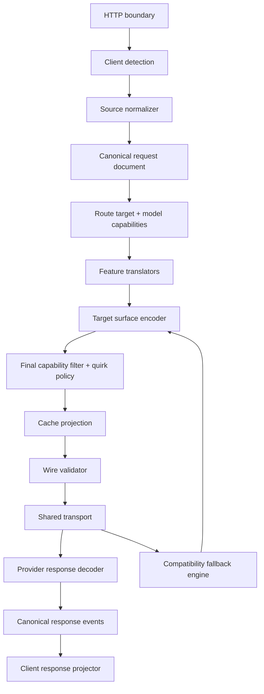

# Unified OpenSSE Translation Design

## Overview

`src/open-sse` will expose one capability-aware translation pipeline shared by every CLI profile and provider adapter. The pipeline separates source detection, canonical request semantics, target capability negotiation, feature projection, wire encoding, compatibility fallback, and response projection.

The design preserves existing public request/response contracts during migration. New contracts are introduced beside the existing `ProxyRequest`, then adapters migrate incrementally. No provider-specific behavior is removed until a contract test covers the replacement path.

### Goals

- One reusable translation policy for Claude Code, Codex, Cursor, Gemini CLI, Cline, OpenCode, and generic clients.
- Capabilities resolved for the selected provider model and target surface.
- No arbitrary raw payload copying into outbound requests.
- Cache projection applied after all provider-specific mutations.
- Optional compatibility features retried once when explicitly rejected.
- Stream and non-stream response semantics normalized through the same document model.
- Bounded diagnostics without prompt, credential, or authorization leakage.

### Non-goals

- Fabricating unsupported provider features.
- Retrying semantic or required-field failures by deleting request content.
- Replacing provider SDKs or implementing provider business logic in the translation layer.
- Guaranteeing cache hits when the provider, TTL, traffic affinity, or prompt prefix prevents reuse.

## Architecture



### Pipeline invariants

1. Source and target surfaces are distinct values. A client identity never determines the provider model identity.
2. `RouteTarget.upstreamModelId` is the only model identifier sent to upstream providers.
3. Canonical semantic fields are created by normalizers; raw wire fields are accepted only through an explicit extension allowlist.
4. Capability filtering occurs before transport I/O.
5. Cache markers/options are emitted only from the final target payload and selected model capability.
6. A compatibility retry can remove optional projections only; it cannot remove messages, tools, user content, or required authentication.
7. A stream may retry only before meaningful output or a terminal event.
8. Client-facing model identity is the requested model; upstream identity remains internal route metadata unless a surface contract requires otherwise.

## Components and interfaces

### 1. Translation context

New module: `src/open-sse/translate/context.ts`.

```ts
interface TranslationContext {
  readonly source: {
    readonly client: ClientProfile;
    readonly format: ClientFormat;
    readonly surface: Surface;
  };
  readonly target: {
    readonly providerId: string;
    readonly modelId: string;
    readonly upstreamModelId: string;
    readonly surface: Surface;
    readonly capabilities: ModelCapabilities;
  };
  readonly policy: TranslationPolicy;
  readonly diagnostics: TranslationDiagnosticSink;
}
```

The context is immutable. Providers receive it through `ProviderRequest` or an adapter-local encoder context; it is not serialized into the upstream payload.

### 2. Model capability matrix

New module: `src/open-sse/translate/capabilities.ts`.

```ts
interface ModelCapabilities {
  readonly surfaces: readonly Surface[];
  readonly streaming: boolean;
  readonly reasoning: ReasoningCapabilities;
  readonly cache: CacheCapabilities;
  readonly tools: ToolCapabilities;
  readonly response: ResponseCapabilities;
  readonly media: MediaCapabilities;
}

interface ReasoningCapabilities {
  readonly supported: boolean;
  readonly efforts: readonly CanonicalEffort[];
  readonly maxTokens: "supported" | "unsupported" | "unknown";
  readonly summary: boolean;
  readonly modes: readonly string[];
}

interface CacheCapabilities {
  readonly read: boolean;
  readonly write: boolean;
  readonly key: boolean;
  readonly breakpoints: boolean;
  readonly ttl: readonly string[];
  readonly options: readonly string[];
}
```

The existing `ProviderCaps` remains as a compatibility input. `resolveModelCapabilities(providerCaps, modelCaps, targetSurface)` performs conservative intersection/override resolution:

- model-specific values win when known;
- provider defaults fill only unknown model values;
- aggregate provider OR values are never treated as proof that every model supports a feature;
- unknown optional features default to disabled for outbound projection.

`RouteTarget` will gain a capability reference or the surrounding `ProviderRequest` will carry the resolved matrix. The selected `modelId`, `upstreamModelId`, and target surface remain explicit.

### 3. Feature translators

New module family: `src/open-sse/translate/features/`.

Each translator is pure and returns a value plus dispositions:

```ts
interface FeatureTranslation<T> {
  readonly value: T;
  readonly dispositions: readonly FieldDisposition[];
  readonly diagnostics: readonly TranslationDiagnostic[];
}
```

Initial translators:

- `reasoning.ts`: canonical effort, summary, mode, context, and budget intent.
- `tools.ts`: function/native tool projection and call ledger preservation.
- `cache.ts`: canonical `CacheIntent` and target marker projection.
- `response.ts`: text, JSON object, JSON schema, max output, and parallel calls.
- `identity.ts`: client-facing versus upstream model identity rules.
- `context.ts`: context management, previous response, include fields, and session metadata.
- `media.ts`: image/media references and operation-specific restrictions.

Existing `request/openai-chat.ts`, `request/openai-responses.ts`, and `request/anthropic.ts` become surface encoders that consume these translators instead of implementing independent semantic mappings.

### 4. Capability-aware target encoders

The target surface encoders retain their wire-specific shape:

```ts
interface TargetEncoder {
  readonly target: Surface;
  encode(document: RequestDocument, context: TranslationContext): EncodedPayload;
  validate(payload: EncodedPayload, context: TranslationContext): readonly TranslationDiagnostic[];
}
```

Encoding order:

1. Construct target-native payload from canonical document.
2. Apply feature translations.
3. Filter fields unsupported by the selected model capability matrix.
4. Apply declarative provider quirk policy.
5. Apply cache projection.
6. Validate required fields and bounded sizes.
7. Capture the final payload at the transport boundary.

### 5. Raw source extension policy

`preserveWirePayload` will be narrowed to `preserveWireExtensions`. Same-surface preservation may retain only fields explicitly registered for that source/target pair. Each extension declares:

```ts
interface WireExtensionRule {
  readonly source: ClientFormat;
  readonly target: Surface;
  readonly field: string;
  readonly validate: (value: unknown) => boolean;
  readonly redact?: boolean;
}
```

Unknown fields are not copied. Rejected fields receive `dropped-with-diagnostic` dispositions when they are optional; required semantic fields fail normalization.

### 6. Compatibility fallback engine

New module: `src/open-sse/translate/fallback.ts`.

```ts
interface CompatibilityRejection {
  readonly category: "unsupported-field" | "unsupported-cache" | "unsupported-reasoning" | "unsupported-tool" | "unsupported-response";
  readonly fieldPath: string;
  readonly optional: boolean;
  readonly retryable: boolean;
}

interface CompatibilityRule {
  readonly matches: (error: ProviderCallError) => CompatibilityRejection | null;
  readonly remove: (payload: Record<string, unknown>, rejection: CompatibilityRejection) => void;
}
```

Rules are allowlisted and bounded. A retry is allowed only when:

- HTTP/provider error explicitly identifies an optional unsupported parameter;
- request has not emitted meaningful stream output;
- the same rejection has not already been retried;
- removal does not affect authentication, messages, tools' semantic content, or required model fields.

The retry reuses the same network/credential attempt when safe and preserves valid fields such as `prompt_cache_key`. It records a diagnostic with the category, field category, and outcome.

### 7. Cache intent and final projection

New module: `src/open-sse/translate/features/cache.ts`.

```ts
interface CacheIntent {
  readonly key: string | null;
  readonly stablePrefixFingerprint: string | null;
  readonly affinityKey: string | null;
  readonly policy: "automatic" | "explicit" | "ephemeral";
  readonly ttl: string | null;
}
```

The cache analyzer runs after provider compatibility mutation. It identifies the longest stable prefix and stops at volatile metadata, timestamps, UUIDs, credentials, billing/session headers, dynamic user content, or tool results. It produces one intent; each target encoder projects it as follows:

- Anthropic: `cache_control.type = "ephemeral"` on an eligible block.
- OpenAI models with explicit breakpoint capability: `prompt_cache_key`, options, and breakpoint marker.
- OpenAI-compatible providers with key-only capability: `prompt_cache_key` only.
- Providers without cache capability: no cache fields; diagnostic only when the client requested cache semantics.

Cache projection is structural-sharing and bounded. It never stores prompt text in diagnostics.

### 8. Shared transport and response symmetry

All provider wire calls use shared lifecycle, body-limit, capture, error mapping, and stream recovery contracts. Existing direct adapters migrate to one of:

- `callChatCompletionsWire`
- `callResponsesWire`
- `callAnthropicWire`
- a provider protocol function implementing the same `ProviderRequest`/`ProviderOutput` contract.

Provider decoders produce canonical `StreamEvent` values. Non-stream bodies are folded into `ResponseDocument` through the same response event model. Surface response projectors then apply client-facing model identity, usage semantics, cache details, and tool-call shapes.

## Data flow and migration boundaries

### Current-to-target compatibility

- `ProxyRequest` remains accepted by existing encoders during migration.
- `toRequestDocument()` becomes the canonical bridge and is extended with cache intent and capability context.
- Existing `ProviderCaps` remains readable by adapters until model capability catalogs are migrated.
- Provider-specific adapters may retain URL/auth/header code, but payload feature mutation moves into shared policy modules.
- Existing diagnostics fields remain stable; new categories are additive.

### Adapter migration order

1. OpenAI-compatible shared adapter and native OpenAI.
2. Codex and Grok Responses adapters.
3. Anthropic and Claude Code Messages adapters.
4. AgentRouter and custom providers.
5. Cline, OpenCode, Cloudflare, CodeBuddy, Kimchi, Gemini, and remaining direct adapters.

This order starts with the current cache/reasoning regressions and maximizes shared transport reuse.

## Error handling

- Normalization errors: stable `ProtocolCodecError`, no provider request.
- Capability errors: stable 400 capability error before network I/O when no declared projection exists.
- Optional unsupported fields: omit with bounded diagnostic or compatibility retry.
- Required-field rejection: no blind retry; return classified provider error.
- Empty upstream error detail: map to a non-empty stable category/message such as `Provider rejected the translated request` while retaining status and bounded internal diagnostics.
- Stream truncation: existing lifecycle/recovery policy remains authoritative.
- Fallback loop: maximum one retry per compatibility rejection and maximum configured route attempts overall.

## Observability

Diagnostics never include raw prompts, tool arguments, credentials, authorization headers, or arbitrary provider response bodies. They may include:

- source format and target surface;
- provider/model IDs from route metadata;
- feature category;
- action/disposition;
- cache-key and breakpoint presence;
- compatibility rejection category;
- retry count and result;
- final normalized error kind.

Payload capture remains opt-in and bounded at the existing transport boundary.

## Testing strategy

### Unit contracts

- effort vocabulary matrix for all client aliases and target provider vocabularies;
- capability resolution for mixed model catalogs;
- extension allowlist and raw field rejection;
- cache stable-prefix boundary and final projection;
- compatibility rejection matching/removal;
- identity projection;
- usage normalization.

### Translation matrix

For each source profile and target surface, assert:

- canonical semantic equivalence;
- unsupported field behavior;
- tools and reasoning preservation;
- cache key/marker behavior;
- response format projection;
- client-facing model identity.

### Transport integration

- optional cache/reasoning field rejection retries exactly once;
- valid fields survive retry;
- stream retries stop after meaningful output;
- non-stream and stream errors use the same categories;
- capture sees final attempted payloads under bounded limits.

### Provider smoke

Use deterministic mocked upstream responses for each adapter family. Live provider calls are not required for unit/contract proof; a separate operator smoke command may be run when credentials are available.

## Rollout and acceptance gates

Each migration slice must pass:

1. Typecheck.
2. Focused translation tests.
3. Transport lifecycle tests.
4. Provider adapter contract tests.
5. Existing backend regression suite.
6. Build and localhost health smoke.

The implementation is complete only when all direct payload bypasses are either migrated or listed as explicit tested exceptions.
