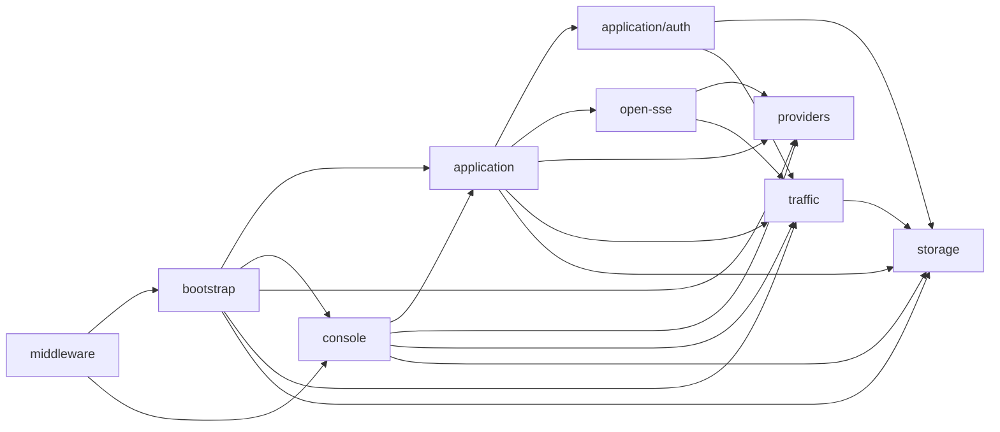

# Source Restructure Design

## Overview

Cartethyia will split only multi-responsibility modules along existing ownership boundaries. This is a source-only clean cutover: moved symbols have exactly one canonical owner; all production and test imports move in the same slice; old forwarding files, aliases, and duplicate implementations are forbidden.

**Correction:** all established top-level folders remain except the approved application-lifecycle move of `auth/` to `application/auth/`. In particular, `open-sse/`, `bootstrap/`, `middleware/`, and `storage/` are retained exactly as named. This avoids root-level import churn that adds no architectural value.

## Architectural decisions

| Decision | Choice | Rationale |
|---|---|---|
| Top-level folders | Retain every current root except `auth/` → `application/auth/` | Authentication is application lifecycle; all other root moves add no architectural value. |
| Split threshold | Normally 150–450 LOC; >500 only when one protocol/provider flow remains cohesive | Avoids splitting merely to improve a number. |
| Naming | Domain names only; no `utils`, `helpers`, `common`, `shared`, or `misc` | Import paths remain self-explanatory. |
| Import policy | Direct file imports; no subdirectory barrels | One canonical owner per export. |
| Migration | Atomic clean cutover per architectural slice | No legacy source paths or compatibility debt. |
| SQLite | Native Bun SQLite and current repository contracts remain | No ORM, schema migration, or database redesign. |
| HTTP/API | Existing paths, methods, validation, responses, and auth semantics remain | Structural migration must not modify product behavior. |
| Composition | `bootstrap/` stays the sole runtime assembly root | Application wiring stays explicit. |

## Target tree

This is the proposed end-state tree. `=` marks a directory whose name and broad responsibility stay unchanged; `+` marks a new cohesive file/folder.

```text
src/
├── main.ts
│
├── application/ =
│   ├── contracts.ts
│   ├── protocols.ts
│   ├── cache.ts
│   ├── cli-model-mapping.ts
│   ├── filter-rules.ts
│   ├── model-metadata.ts
│   ├── rate-limit.ts
│   ├── recovery-sweep.ts
│   ├── routing.ts
│   ├── routing-snapshot.ts
│   └── request/ +
│       ├── contracts.ts
│       ├── prepare.ts
│       ├── payload-capture.ts
│       ├── telemetry.ts
│       ├── route-attempt.ts
│       └── execute.ts                 # canonical runProxyRequest owner
│   ├── auth/ +
│   │   ├── oauth/
│   │   ├── quota/
│   │   ├── contracts.ts
│   │   ├── credential-bundle.ts
│   │   ├── credentials.ts             # reviewed later; not forcibly split
│   │   ├── drivers.ts
│   │   ├── oauth-callback-server.ts
│   │   ├── oauth-refresher.ts
│   │   ├── oauth-sessions.ts
│   │   ├── oauth-state.ts
│   │   └── token-refresh.ts
│
│
├── bootstrap/ =
│   ├── composition.ts                 # thin public composition façade
│   ├── registry.ts +                  # provider registry + model metadata assembly
│   ├── routing.ts +                   # resolver, revision tracking, account candidates
│   ├── workers.ts +                   # OAuth/quota/recovery workers
│   ├── console.ts +                   # console repos/services/API assembly
│   └── lifecycle.ts +                 # shutdown and scheduled maintenance
│
├── console/ =
│   ├── api/ +
│   │   ├── index.ts                   # explicit createConsoleApi composition
│   │   ├── auth-routes.ts
│   │   ├── account-routes.ts
│   │   ├── provider-routes.ts
│   │   ├── model-routes.ts
│   │   ├── proxy-routes.ts
│   │   ├── routing-routes.ts
│   │   ├── settings-routes.ts
│   │   ├── telemetry-routes.ts
│   │   ├── backup-routes.ts
│   │   └── stream-routes.ts
│   ├── services/ +
│   │   ├── composition.ts             # createConsoleServices only
│   │   ├── auth.ts
│   │   ├── api-keys.ts
│   │   ├── accounts.ts
│   │   ├── oauth.ts
│   │   ├── quota.ts
│   │   ├── providers.ts
│   │   ├── models.ts
│   │   ├── proxies.ts
│   │   ├── routing.ts
│   │   ├── settings.ts
│   │   ├── filter-rules.ts
│   │   ├── telemetry.ts
│   │   └── backup.ts
│   ├── views/ +
│   │   ├── auth.ts
│   │   ├── accounts.ts
│   │   ├── providers.ts
│   │   ├── models.ts
│   │   ├── proxies.ts
│   │   ├── routing.ts
│   │   ├── settings.ts
│   │   └── telemetry.ts
│   ├── cli-tools/ =
│   ├── compat/ =
│   ├── db-map/ =
│   ├── warp/ =
│   ├── diagnostics.ts
│   ├── input-sanitizers.ts
│   ├── logger.ts
│   ├── probe.ts
│   ├── route-transitions.ts
│   ├── runtime-settings.ts
│   ├── session.ts
│   ├── share.ts
│   ├── static.ts
│   ├── streams.ts
│   └── wiring.ts
│
├── middleware/ =                  # no structural split planned; all files cohesive
│   ├── console.ts
│   ├── proxy.ts
│   ├── query.ts
│   ├── server.ts
│   └── shared.ts
│
├── observability/ =
│   ├── metrics.ts
│   └── tracing.ts
│
├── open-sse/ =
│   ├── concerns/
│   │   └── tool-calls.ts
│   ├── handlers/
│   │   └── recovery.ts
│   ├── rtk/
│   │   ├── autodetect.ts
│   │   ├── headroom-config.ts
│   │   ├── headroom.ts
│   │   └── index.ts
│   ├── translate/ =
│   │   ├── codecs/
│   │   ├── converters/
│   │   ├── body.ts
│   │   ├── errors.ts
│   │   ├── index.ts
│   │   ├── registry.ts
│   │   └── surface.ts
│   └── transport/ =
│       ├── contracts.ts +
│       ├── errors.ts +
│       ├── abort-coordinator.ts +
│       ├── body-reader.ts +
│       ├── fetch.ts +
│       ├── sse-decoder.ts +
│       ├── stream-mapper.ts +
│       ├── catalog.ts +
│       ├── openai-adapter.ts +
│       └── protocols/ =
│           ├── anthropic.ts
│           ├── gemini.ts
│           └── openai.ts
│
├── providers/ =                    # provider adapters remain grouped by upstream
│   ├── quota/
│   ├── surfaces/
│   └── *.ts
│
├── security/ =
│   ├── access.ts
│   ├── redirect-policy.ts
│   └── ssrf-guard.ts
│
├── storage/ =
│   ├── index.ts                    # narrow explicit public persistence contract
│   ├── main/ =
│   │   ├── env.ts
│   │   ├── schema.sql.ts
│   │   ├── schema.ts
│   │   ├── records.ts
│   │   ├── mappers.ts +
│   │   ├── database.ts +
│   │   ├── backup.ts
│   │   ├── stores.ts +
│   │   ├── persistence.ts +         # canonical createConfigPersistence owner
│   │   └── repositories/ +
│   │       ├── settings.ts
│   │       ├── api-keys.ts
│   │       ├── accounts.ts
│   │       ├── route-health.ts
│   │       ├── proxies.ts
│   │       ├── provider-models.ts
│   │       ├── routing.ts           # aliases, combos, CLI mappings
│   │       ├── custom-providers.ts
│   │       ├── filter-rules.ts
│   │       ├── share-links.ts
│   │       ├── ip-bans.ts
│   │       └── warp-accounts.ts
│   └── runtime/ =
│       ├── schema.sql.ts
│       ├── contracts.ts +
│       ├── database.ts +
│       ├── write-buffer.ts +
│       ├── request-history.ts +
│       ├── payloads.ts +
│       ├── console-logs.ts +
│       ├── warp-metrics.ts +
│       ├── retention.ts +
│       └── persistence.ts +         # canonical createRuntimePersistence owner
│
└── traffic/ =
    ├── admission.ts
    ├── in-flight.ts
    ├── limits.ts
    ├── memory.ts
    ├── network.ts                   # reviewed later; not forcibly split
    ├── per-ip.ts
    └── rate-limiter.ts
```

## Canonical owner changes

Only these files move into subfolders. Top-level roots do not move.

| Symbol | Current owner | Canonical owner |
|---|---|---|
| `runProxyRequest` | `application/request.ts` | `application/request/execute.ts` |
| `createCartethyiaRuntime`, `CartethyiaRuntime` | `bootstrap/composition.ts` | `bootstrap/composition.ts` |
| `auth/**` | `auth/**` | `application/auth/**` |
| runtime composition helpers | `bootstrap/composition.ts` | `bootstrap/{registry,routing,workers,console,lifecycle}.ts` |
| `createConsoleServices`, `ConsoleServices` | `console/services.ts` | `console/services/composition.ts` |
| each named admin service | `console/services.ts` | matching `console/services/<domain>.ts` |
| `createConsoleApi` | `console/api.ts` | `console/api/index.ts` |
| each console route registration | `console/api.ts` | matching `console/api/<domain>-routes.ts` |
| console view DTOs | `console/views.ts` | matching `console/views/<domain>.ts` |
| `createConfigPersistence`, `ConfigPersistence` | `storage/main/config.ts` | `storage/main/persistence.ts` |
| config repository/store owners | `storage/main/config.ts` | matching `storage/main/repositories/*`, `stores.ts` |
| `createRuntimePersistence`, `RuntimePersistence` | `storage/runtime/runtime.ts` | `storage/runtime/persistence.ts` |
| runtime repository owners | `storage/runtime/runtime.ts` | matching `storage/runtime/*.ts` |
| transport exports | `open-sse/transport/shared.ts` | matching `open-sse/transport/*.ts` |

## Dependency rules



Forbidden edges:

- `storage/` MUST NOT import `bootstrap/`, `middleware/`, `console/`, `application/`, `open-sse/`, or `providers/`.
- `providers/` MUST NOT import `console/`, `middleware/`, `bootstrap/`, or storage implementation modules.
- `open-sse/` MUST NOT import `console/`, `middleware/`, or `bootstrap/`.
- `application/` MUST NOT import `console/`, `middleware/`, or `bootstrap/`.
- No module MAY import a parent directory solely for re-exports.

## Detailed decomposition

### Bootstrap composition

`bootstrap/composition.ts` stays as the public façade. Its only duties after the split are: call internal assemblers, build `CartethyiaRuntime`, and return its public contract.

| File | Responsibility |
|---|---|
| `bootstrap/registry.ts` | default provider registry and model metadata assembly. |
| `bootstrap/routing.ts` | route resolver, routing revision tracker, account candidates, request logging policy. |
| `bootstrap/workers.ts` | OAuth refresh policy, quota refresh worker, account recovery worker. |
| `bootstrap/console.ts` | console repositories, services, API, diagnostics, log stream, Warp service. |
| `bootstrap/lifecycle.ts` | GC scheduling and deterministic shutdown ordering. |
| `bootstrap/composition.ts` | invoke those builders and expose `createCartethyiaRuntime`. |

### Storage main

`storage/main/config.ts` splits dependency-first. No SQL query, schema, table, column, backup, or migration behavior changes.

| File/group | Responsibility |
|---|---|
| `main/mappers.ts` | row-to-domain mappings and credential-kind normalization. |
| `main/database.ts` | lazy database opening, schema initialization, existing-column repair, singleton lifecycle. |
| `main/repositories/settings.ts` | settings, runtime settings, password/JWT mutations. |
| `main/repositories/api-keys.ts` | API keys, secret cache, touch buffer, one-time token accounting. |
| `main/repositories/accounts.ts` | provider accounts and account health. |
| `main/repositories/route-health.ts` | durable account/proxy health. |
| `main/repositories/proxies.ts` | proxy records/settings/test state. |
| `main/repositories/provider-models.ts` | provider model persistence. |
| `main/repositories/routing.ts` | aliases, combos, CLI mapping state. |
| `main/repositories/custom-providers.ts` | custom provider records. |
| `main/repositories/filter-rules.ts` | filter rule ordering/mutation. |
| `main/repositories/share-links.ts`, `ip-bans.ts`, `warp-accounts.ts` | isolated narrow tables. |
| `main/stores.ts` | durable route health, account health, locks, quota, OAuth token, credential config, proxy pool stores. |
| `main/persistence.ts` | repository/store composition and factory lifecycle only. |

### Storage runtime

`storage/runtime/runtime.ts` is split by telemetry data lifecycle. Current SQLite tuning, prepared statement reuse, write buffering, cache TTL, retention, and test reset behavior remain identical.

| File | Responsibility |
|---|---|
| `runtime/contracts.ts` | runtime records, filters, summaries, repository interfaces. |
| `runtime/database.ts` | opening, pragmas, schema validation, reset support. |
| `runtime/write-buffer.ts` | queued write batching, prepared statement reuse, retries, statistics. |
| `runtime/request-history.ts` | telemetry writer, request history and aggregate queries. |
| `runtime/payloads.ts` | payload artifact persistence. |
| `runtime/console-logs.ts` | console log list/push/after/filter/category mapping. |
| `runtime/warp-metrics.ts` | record/page/latest/summary/prune. |
| `runtime/retention.ts` | batched table/file retention. |
| `runtime/persistence.ts` | factory, singleton, lifecycle, maintenance scheduler. |

### Console

| Domain | Service | API routes | Views |
|---|---|---|---|
| Console auth/session and API keys | `services/auth.ts`, `api-keys.ts` | `api/auth-routes.ts` | `views/auth.ts` |
| Accounts, OAuth, quota | `accounts.ts`, `oauth.ts`, `quota.ts` | `api/account-routes.ts` | `views/accounts.ts` |
| Providers and models | `providers.ts`, `models.ts` | `api/provider-routes.ts`, `model-routes.ts` | `views/providers.ts`, `models.ts` |
| Proxy pool | `proxies.ts` | `api/proxy-routes.ts` | `views/proxies.ts` |
| Aliases, combos, CLI mapping | `routing.ts` | `api/routing-routes.ts` | `views/routing.ts` |
| Settings and filters | `settings.ts`, `filter-rules.ts` | `api/settings-routes.ts` | `views/settings.ts` |
| Telemetry, logs, SSE | `telemetry.ts` | `api/telemetry-routes.ts`, `stream-routes.ts` | `views/telemetry.ts` |
| Backup/reset/restore | `backup.ts` | `api/backup-routes.ts` | `views/settings.ts` |

`console/api/index.ts` composes `register…Routes()` calls. It contains no endpoint-specific logic.

### Application request lifecycle

| File | Responsibility |
|---|---|
| `application/request/contracts.ts` | proxy request input, route plan, authorization, dependencies, request-log event. |
| `application/request/prepare.ts` | normalize/validate request; apply tool safety, headroom, token saving; calculate admission estimate. |
| `application/request/payload-capture.ts` | bounded redacted request/response capture. |
| `application/request/telemetry.ts` | start/final telemetry projection and request-log event formation. |
| `application/request/route-attempt.ts` | candidate credential/network choice, upstream call, handoff, retryable failure classification. |
| `application/request/execute.ts` | ordered request lifecycle and `runProxyRequest`. |

### Open SSE transport

`open-sse/` remains untouched as a root. Only its 822-line `transport/shared.ts` is decomposed.

| File | Responsibility |
|---|---|
| `transport/contracts.ts` | shared transport types. |
| `transport/errors.ts` | provider/upstream error mapping and retry-after parsing. |
| `transport/abort-coordinator.ts` | caller, connection, total, and idle abort handling. |
| `transport/body-reader.ts` | bounded upstream text/JSON reads. |
| `transport/fetch.ts` | direct/proxy fetch execution and redirect SSRF validation. |
| `transport/sse-decoder.ts` | bounded SSE line/event parsing. |
| `transport/stream-mapper.ts` | canonical stream transformation/terminal handling. |
| `transport/catalog.ts` | model capabilities and catalog composition. |
| `transport/openai-adapter.ts` | OpenAI-compatible adapter construction. |

Protocol request formats remain under `open-sse/transport/protocols/`; translation codecs remain under `open-sse/translate/codecs/`.

## Repository-wide naming and construction contract

This is a source-wide contract, not a short factory-renaming list. It applies to every production symbol under `src/**`, including local helpers. Existing modules retain their current domains; this section controls the vocabulary used inside them.

### Symbol grammar

Names have the form:

```text
<verb><Domain?><SpecificNoun>
<Domain><SpecificNoun>
```

The verb communicates the operation. The optional domain qualifier appears only when the bare noun would be ambiguous at an import boundary. The final noun identifies the owned value, protocol surface, aggregate, or resource. Examples: `createConsoleLogStreamHub`, `resolveCliModelMapping`, `parseOAuthCallbackValue`, `recordRouteSwitch`, and `createOpenAIResponsesStreamMapper`.

Use `camelCase` for values, functions, parameters, methods, and fields; `PascalCase` for classes, interfaces, types, and error classes; `SCREAMING_SNAKE_CASE` only for immutable process-wide constants. Files and directories use lowercase kebab-case. A local identifier does not repeat its enclosing type/module (`const cache` inside `RouteSnapshotCache`, not `routeSnapshotCache`).

### Function verbs: complete vocabulary

| Intent | Required verb and contract | Examples |
|---|---|---|
| Construct a stateful/value object | `create<SpecificNoun>` | `createConfigPersistence`, `createAbortCoordinator`, `createOpenAIAdapter` |
| Construct a mountable Elysia sub-application | `create<Domain>Api` | `createWarpApi`, `createCliToolsApi` |
| Add routes/callbacks to a caller-owned object | `register<Domain>Routes` / `register<Domain>Callback` | `registerOAuthCallback` |
| Remove a prior registration | `unregister<Domain>Callback` | `unregisterOAuthCallback` |
| Process exactly one external request/event/job | `handle<SpecificAction>` | `handleShareRequest`, `handleProxyRequest` |
| Invoke a provider-native operation | `call<Provider><WireOperation>` | `callAnthropicWire`, `callResponsesWire` |
| Execute a named side-effecting operation | `execute<Operation>` / `run<Operation>` | `executeFetch`, `runProxyRequest` |
| Derive a compound output | `build<SpecificValue>` | `buildCachePlan`, `buildMessagesPayload`, `buildSessionCookie` |
| Calculate a numeric/ordering result | `calculate<SpecificValue>` | `calculateRateLimitBackoffMs`, `calculateRendezvousScore` |
| Choose an existing item from candidates | `select<SpecificNoun>` | `selectGeminiCandidate`, `selectCredential` |
| Resolve through references/aliases/configuration | `resolve<SpecificNoun>` | `resolveModelChain`, `resolveWireSurface`, `resolveRedirectTarget` |
| Parse untrusted structured text/value | `parse<SpecificNoun>` | `parseTraceParent`, `parseOAuthCallbackValue`, `parseBoundedInteger` |
| Decode/encode a reversible representation | `decode<Format>To<Value>` / `encode<Value>As<Format>` | `decodeBase64ToText`, `encodeBytesAsBase64Url` |
| Translate between public protocol surfaces | `translate<Source>To<Target>` or `translate<SpecificValue>` | `translateLegacyGet`, `translateGeminiResponse` |
| Map one known source shape to another | `map<Source>To<Target>` | `mapAnthropicUsage`, `mapSseStream` |
| Normalize semantically equivalent input | `normalize<SpecificNoun>` | `normalizeRequest`, `normalizeStudioMessages` |
| Sanitize untrusted input for safe downstream use | `sanitize<SpecificNoun>` | `sanitizeRuntimePatch`, `sanitizeMessage` |
| Extract a subset without interpretation | `extract<SpecificNoun>` | `extractAccessToken`, `extractTraceContext` |
| Format a display/wire string | `format<SpecificNoun>` | `formatTraceParent`, `formatHeadroomSummary` |
| Convert a known value representation | `to<TargetNoun>` | `toProviderCallError`, `toWarpAccountView` |
| Classify a known value | `<Domain>CategoryOf` / `classify<SpecificNoun>` | `logCategoryOfScope`, `classifyProviderFailure` |
| Obtain one existing entity | `get<SpecificNoun>` | `getStudioSession`, `getToolDefinition` |
| Obtain several entities | `list<SpecificNounPlural>` | `listStudioSessions`, `listToolDefinitions` |
| Filter/aggregate persisted data | `query<SpecificNounPlural>` | `queryRequests`, `queryUsageSummary` |
| Read/write an external byte/text boundary | `read<SpecificNoun>` / `write<SpecificNoun>` | `readBoundedJson`, `writeJsonFile` |
| Change stored state | `insert`, `update`, `patch`, `delete`, `clear`, `restore`, `prune` + specific noun | `patchStudioSession`, `deleteStudioSession`, `restoreConfigBackup` |
| Record an observation or telemetry fact | `record<SpecificObservation>` | `recordAccessLog`, `recordRouteSwitch`, `recordProbe` |
| Start/stop/close a lifecycle | `start`, `stop`, `close`, `schedule`, `cancel` + specific noun | `startServer`, `stopWireProxy`, `scheduleGlobalGc` |
| Reserve/relinquish a resource | `acquire` / `release` + specific noun | `acquireAdmissionLease`, `releaseProxyPermit` |
| Boolean predicate | `is`, `has`, `can`, `should`, `needs`, `requires` + noun/adjective | `isRouteAllowed`, `hasStablePrefix`, `requiresJsonContentType` |
| Enforce by throwing | `assert` / `ensure` + invariant | `assertPublicUrl`, `ensureBootstrapProxyKey` |

`make`, `do`, `process`, `data`, `util`, `helper`, `common`, and a bare `Handler` are prohibited in production identifiers. `write` is reserved for actual sink/response-body I/O; a function returning a `Response` or `PresentedProxyResponse` without writing to a sink uses `create` or `present`.

### Role nouns and type shapes

| Role | Required name | Meaning |
|---|---|---|
| Immutable domain data | singular noun / `Record` | `ProviderAccountRecord` is persisted data; `ProviderAccount` is an in-memory domain value. |
| Caller-supplied configuration | `Config` | Stable, already-valid configuration owned by the caller. |
| Optional construction tuning | `Options` | Omit fields to select defaults; never use `Config` for this. |
| Boundary mutation/request payload | `Input` | Untrusted until validated/normalized. |
| Operation outcome | `Result` | Returned result, including discriminated success/failure unions. |
| Safe presentation projection | `View` | Never contains credential secrets. |
| Immutable computed state | `Snapshot` | Read-only point-in-time state, typically cacheable. |
| Selection/behavior rule | `Policy` | No resource ownership or I/O. |
| Persistence port | `Repository` | Domain-facing CRUD/query contract; SQL row details stay below it. |
| Narrow durable/in-memory backend | `Store` | Keyed state primitive such as token, health, or lock storage. |
| Business operation façade | `Service` | Coordinates repositories and domain policy; no HTTP parsing/serialization. |
| Provider protocol implementation | `Adapter` | Implements `Adapter` and owns provider-native request/response behavior. |
| OAuth implementation | `Driver` | Implements `AuthDriver` for a provider's OAuth protocol. |
| Named collection/lookup | `Registry` | Registers and resolves values by identity. |
| Stateful domain lifecycle | `Manager` / `Pool` | `Manager` owns a lifecycle; `Pool` arbitrates reusable leases/resources. |
| Periodic background execution | `Worker` / `Sweep` | `Worker` schedules work; `Sweep` performs one bounded recovery pass. |
| Stateful request/stream lifecycle | `Controller` / `Coordinator` | `Controller` owns mutable state; `Coordinator` joins independent concerns. |
| Bounded derived-value retention | `Cache` | Must state invalidation/rebuild behavior. |
| Metrics aggregation | `Collector` | Records and renders metrics only. |
| Typed exceptional condition | `<Domain>Error` | Carries classification safe for its boundary. |

Classes name the owned role, never their implementation technique. Interfaces name the capability/port, not a prefixed `I…` variant. Type aliases name unions, transformations, or literal domains. `*Data`, `*Info`, `*Item`, `*Helper`, and `*Utils` are forbidden unless they name a third-party wire term.

### Boundary, callback, and field rules

- A callback is named `on<Subject><PastTense>` when it observes an event (`onTokenRefreshed`, `onRouteSwitch`), `before<Operation>` before an action, and `after<Operation>` after it. Do not use `callback`, `handler`, or `fn`.
- `request`, `response`, `body`, `headers`, `params`, `query`, `row`, `record`, `item`, `entry`, `result`, `error`, `signal`, `config`, and `options` are allowed only where their static type makes the resource unambiguous.
- Database rows use the storage schema's field names only in row-mapper scope. Immediately map them to camelCase domain `Record`/`View` values.
- Provider wire JSON keeps external spelling only inside the relevant `providers/**`, `open-sse/translate/codecs/**`, or `auth/oauth/**` boundary. The next internal value is normalized to Cartethyia vocabulary.
- `null` means an intentional known absence; `undefined` means missing/unsupplied input. Names such as `parseOptionalString` and `parseNullableString` expose that distinction.

### Module and route naming

Each file has one owner noun and a lowercase kebab-case name. A file exporting an implementation uses that role name (`registry.ts`, `credentials.ts`, `request.ts`); a route module uses `<domain>-routes.ts`; a codec uses the protocol/surface it converts; a persistence module uses the bounded aggregate it owns. Do not introduce generic `index.ts`, `shared.ts`, `common.ts`, `helpers.ts`, or `utils.ts` files during the restructure; existing boundary entry points are replaced in their owning slice rather than expanded.

`create<Domain>Api` constructs the independently mountable Elysia app and exactly the services whose lifecycle it returns. `register<Domain>Routes` only attaches routes to an app passed in and receives dependencies through an explicit `…RouteDependencies` object. It must not instantiate a service, repository, worker, registry, or sub-application.

### Single-owner construction and intentional per-request construction

The caller scan found one production construction site each for the current long-lived console composition:

| Factory | Single construction owner |
|---|---|
| `createCartethyiaRuntime` / `createConfigPersistence` / `createDefaultRegistry` | `bootstrap/composition.ts` |
| `createConsoleServices` / `createConsoleApi` | `bootstrap/composition.ts` |
| `createWarpApi` / `createCliToolsApi` / `createDbMapApi` | `console/api.ts` |

After the split, `bootstrap/composition.ts` remains the sole owner for the top-level runtime and `console/api/index.ts` the sole owner for mounted console sub-app instances. The construction rule applies only to long-lived dependencies. Stream mappers and stream lifecycle controllers are deliberately new for each upstream stream because they carry mutable per-stream state. A proxy fetcher is selected for one target; only its reusable low-level SOCKS agent cache is shared.

### Confirmed clean-cutover inventory

This inventory is exhaustive for names already identified as violating the contract in the source-wide exported-symbol scan. The migration uses LSP references per symbol; local helper renames move with their owning module.

| Current symbol(s) | Canonical name(s) |
|---|---|
| `makeOpenAIAdapter`, `makeProviderError`, `makeSessionGuard` | `createOpenAIAdapter`, `createProviderError`, `createSessionGuard` |
| `buildProxyFetcher` | `createProxyFetcher` |
| `makeSettingsRepository`, `makeKeyRepository`, `makeProviderConfigRepository`, `makeModelRepository`, `makeAccountRepository`, `makeProxyRepository`, `makeRoutingRepository`, `makeRuntimeMetadataRepository`, `makeBackupRepository`, `makeCustomProviderRepository` | `createConsoleSettingsRepository`, `createConsoleApiKeyRepository`, `createConsoleProviderConfigRepository`, `createConsoleModelRepository`, `createConsoleAccountRepository`, `createConsoleProxyRepository`, `createConsoleRoutingRepository`, `createConsoleRuntimeMetadataRepository`, `createConsoleBackupRepository`, `createConsoleCustomProviderRepository` |
| `createStreamLifecycle` | `createStreamLifecycleController` |
| `createAnthropicMapper`, `createGeminiMapper`, `createChatMapper`, `createResponsesMapper` | `createAnthropicStreamMapper`, `createGeminiStreamMapper`, `createOpenAIChatStreamMapper`, `createOpenAIResponsesStreamMapper` |
| `writeNonStreamResponse`, `writeStreamResponse`, `writeResponse`, `writeErrorResponse` | `presentNonStreamResponse`, `presentStreamResponse`, `presentProxyResponse`, `presentProxyError` |
| `errorResponse`, `consoleError`, `applicationError`, `configError` | `createProxyErrorResponse`, `createConsoleErrorBody`, `createProtocolError`, `createConfigError` |
| `base64Decode`, `bytesToBase64Url`, `nonEmpty`, `tokenFields` | `decodeBase64ToText`, `encodeBytesAsBase64Url`, `parseNonEmptyString`, `extractOAuthTokenFields` |
| `allToolDefs`, `geminiCandidate`, `responseParts` | `listToolDefinitions`, `selectGeminiCandidate`, `extractGeminiResponseParts` |
| `affinityKeyString`, `rendezvousScore`, `orderByRendezvous` | `formatAffinityKey`, `calculateRendezvousScore`, `sortByRendezvous` |
| `liveTrafficSnapshot`, `liveTrafficStream` | `buildLiveTrafficSnapshot`, `createLiveTrafficStreamResponse` |
| `runtimeRecord`, `runtimeRecordFromJson` | `readRuntimeSettingsRecord`, `readRuntimeSettingsRecordFromJson` |
| `stringOrUndefined`, `nullableString`, `numberOrUndefined`, `boundedNumber`, `booleanOrUndefined`, `recordOrUndefined`, `stringListOrUndefined`, `credentialKind`, `customProviderKind`, `proxyProtocol`, `nullableLimit`, `limitOrUndefined`, `nullableText` | `parseOptionalString`, `parseNullableString`, `parseOptionalFiniteNumber`, `parseBoundedInteger`, `parseOptionalBoolean`, `parseOptionalStringRecord`, `parseOptionalStringList`, `parseCredentialKind`, `parseCustomProviderKind`, `parseProxyProtocol`, `parseNullablePositiveInteger`, `parseOptionalPositiveInteger`, `parseNullableText` |

The inventory is applied only in the slice that owns each module; no compatibility aliases, forwarding exports, or partial callers remain. New symbols must comply immediately. Before the final cleanup slice, an AST/LSP audit of all `src/**/*.ts` symbols verifies that no prohibited generic names or prior names remain.
## Migration protocol

Each slice must:

1. Establish its targeted behavioral baseline.
2. Use LSP references for each moved export.
3. Move code by ownership—never duplicate implementation.
4. Update every direct production and test importer.
5. Delete the old module/range in the same commit; never leave a forwarding path.
6. Run LSP diagnostics over affected `src/` and `test/` files.
7. Run targeted contracts and `bun tsc --noEmit`.
8. Commit only that verified structural slice.

## Implementation order and verification

| Slice | Scope | Verification |
|---|---|---|
| 0 | Baseline and import-owner inventory | backend typecheck and affected existing contracts. |
| 1 | `auth/` → `application/auth/` clean cutover | auth/OAuth/quota contracts, typecheck. |
| 2 | `bootstrap/composition.ts` internal split; folder retained | middleware contracts, typecheck. |
| 3 | `storage/main/config.ts` split; `storage/main/` retained | persistence, share links, Warp lifecycle contracts, typecheck. |
| 4 | `storage/runtime/runtime.ts` split; `storage/runtime/` retained | persistence, logging, middleware contracts, typecheck. |
| 5 | `console/views.ts` and `console/services.ts` split | console/CLI/OAuth/proxy/routing contracts, typecheck. |
| 6 | `console/api.ts` split | middleware contracts, authenticated API smoke, dashboard build. |
| 7 | `application/request.ts` split | middleware, routing-cache, core-policy, session-IP, RTK/headroom contracts, typecheck. |
| 8 | `open-sse/transport/shared.ts` split | translation transport and protocol translation contracts, typecheck. |
| 9 | Review `traffic/network.ts` and `application/auth/credentials.ts` | targeted network/auth/OAuth suite; split only if ownership boundaries remain clear. |
| 10 | Clean final tree | backend suite, dashboard suite, backend typecheck, dashboard build, native build. |

## Error handling and behavior preservation

- `open-sse/transport/errors.ts` remains the only owner that turns upstream failures into provider-call errors.
- `application/request/route-attempt.ts` classifies failures for retry/failover but does not alter HTTP/protocol meaning.
- `middleware/` serializes canonical errors and does not duplicate provider error mapping.
- Console route modules preserve the existing service-selected status codes.
- Storage modules surface the same SQLite errors; no fallback database or silent recovery is introduced.
- OAuth/quota/recovery worker scheduling and shutdown order remain identical.

## Non-goals

- Renaming top-level folders other than the approved `auth/` → `application/auth/` clean cutover.
- Changing HTTP endpoints, authentication, data model, SQLite schema, backup payload, or environment semantics.
- Introducing an ORM, database abstraction layer, aliases, forwarding files, or dual imports.
- Moving cohesive provider adapters only to normalize LOC.
- Dashboard UI or provider feature work in structural commits.
