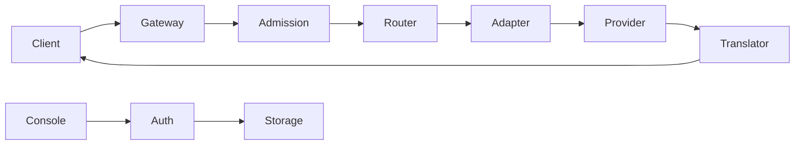

# Concepts

## Architecture



- `src/middleware/`: unified middleware boundary — server entrypoint, method translation, route handlers, guards, body limits, and response ownership.
- `src/application/`: routing, admission, recovery, and shared contracts.
- `src/auth/`: credentials, OAuth, token refresh, account health, and quota lifecycle.
- `src/providers/`: provider identities, models, upstream requests, codecs, and quota transport.
- `src/open-sse/`: canonical stream events, protocol codecs, translation, and transport.
- `src/console/`: authenticated control-plane APIs.
- `src/storage/`: configuration and runtime persistence.

Provider adapters do not own client translation. Open-SSE does not own authentication or quota scheduling.

## Request lifecycle

```text
HTTP request
  → route/body validation
  → API-key authentication
  → admission limits
  → request normalization
  → ACL/model resolution
  → account/proxy selection
  → provider dispatch
  → upstream translation
  → stream decode or response parse
  → client-surface translation
  → telemetry and account health update
```

Invalid client requests and client aborts must not poison an account. Provider and capacity failures are classified before health updates.

## Routing

A client model ID resolves to a direct provider model, alias, or combo. Aliases keep a stable client ID while operators change targets. Combos support fallback or round-robin behavior.

Selection considers provider/model eligibility, ACLs, account health, retry timestamps, per-model locks, sticky affinity, priority, and current in-flight work. Each attempt leases an account and must release or commit it after completion.

## Account selection

Account selection is performed after model and provider resolution. Disabled, unhealthy, cooling-down, unauthorized, or capability-incompatible accounts are excluded. A failure updates the account/model policy; a successful attempt clears applicable failure state.

Provider adapters consume selected credentials. They do not choose accounts.

## OAuth and token refresh

OAuth drivers own provider-specific login, exchange, refresh, and revoke behavior. The auth lifecycle owns request-time, manual, quota-time, and scheduled refreshes through a shared refresh pool and account-level single-flight lease.

Permanent failures such as revoked grants transition an account to `reauth_required`; they must not enter an infinite retry loop.

## Quota and health

Process liveness and account readiness are different. Quota fetchers under `src/providers/quota/` call provider-specific endpoints. Auth owns scheduling, coalescing, persistence, cooldowns, and account health.

Account health records retry timestamps, status codes, sanitized messages, and per-model locks. Recovery sweeps clear expired state without requiring a new request.

## Persistence

Configuration storage contains accounts, API keys, providers, models, routing, proxies, and settings. Runtime storage contains request history, console logs, probes, telemetry, and runtime health data.

`DATA_DIR` is the persistence boundary. Configuration migrations are idempotent. Backup/restore validates table and column allowlists and applies changes transactionally.
