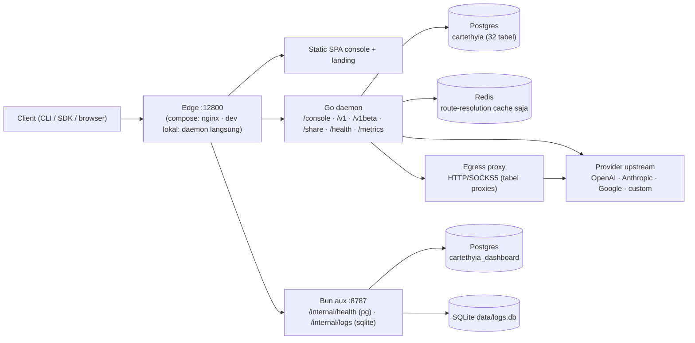
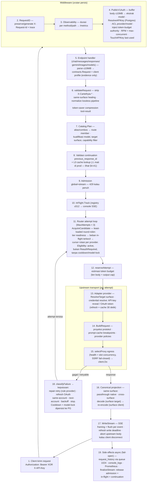
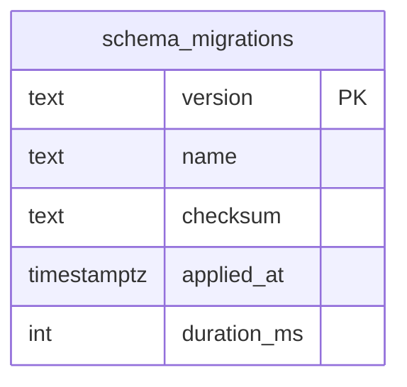

# Cartethyia — Diagram Alur Request & Model Data

> Hasil deep scan 2026-08-17 di branch `go-rewrite` (HEAD `393fd74`). Semua diagram Mermaid — render otomatis di GitHub/VSCode (preview Markdown). Pendamping: [`v2.1-execution-report.md`](./v2.1-execution-report.md) untuk status eksekusi & gap, [`architecture.md`](./architecture.md) untuk narasi arsitektur.

---

## 1. Topologi runtime (konteks)



Catatan penting: dashboard aux memakai DB terpisah `cartethyia_dashboard` — sejak migrasi `0002` DB aux hanya menampung `schema_migrations` (5 tabel orphan dari `0001` sudah di-drop, lihat §3d), dan pemisahan tetap dipertahankan supaya bookkeeping migrasi aux tidak menyentuh DB daemon.

---

## 2. Alur request proxy: client → provider → client

Ini lifecycle lengkap `POST /v1/chat/completions` (surface lain — `/v1beta` Gemini, messages, responses — beda di tahap parsing saja, pipeline-nya sama). Nomor = urutan eksekusi nyata di kode.



**Perbedaan `/v1beta` vs `/v1`**: submux dan auth wrapper sama persis (satu handler tree di-mount dua prefix). Bedanya hanya di handler Gemini: model diambil dari URL path (`/v1beta/models/{model}:generateContent`), stream dari suffix action, dan — ini satu-satunya perbedaan fungsional — Gemini set `ContinuationScope` dari API-key ID, sehingga request Gemini punya cache tenant sementara `/v1/chat/completions` polos tidak.

**Plane share tidak lewat pipeline ini** — `/share/*` di-mount di luar auth wrapper `/v1`, autentikasi via hash token SHA-256 terhadap tabel `share_links`, dan cuma baca agregat telemetry + in-flight global (shared limiter). Traffic share tidak pernah masuk ke proxy.

**Pointer kode per tahap**: router & middleware `daemon/internal/server/router.go:22`, `middleware/public_auth.go:70`; dispatch `proxy/runtime/service.go:151`; catalog `runtime/catalog/catalog.go:972`; pool/akun `runtime/pool.go:298`; router loop `runtime/router.go:287/490`; transport `proxy/transport/http.go:105/186`; telemetry `database/repositories/telemetry_bun.go:44`.

---

## 3. Model data & relasi

### 3a. Postgres daemon (DB `cartethyia`) — klaster relasi eksplisit

Sumber: `daemon/internal/database/migrations/migrations.go` (30 migrasi, urutan diverifikasi `All()`). Semua FK eksplisit `ON DELETE CASCADE`.

```mermaid
erDiagram
    api_keys {
        text id PK
        text name UK
        text key
        text key_prefix
        bool active
        int rate_limit_rpm
        bigint daily_token_limit
        bigint one_time_tokens_reserved
        timestamptz revoked_at
    }
    share_links {
        text id PK
        text api_key_id FK
        text token_hash UK
        text kind
        timestamptz expires_at
    }
    api_key_token_windows {
        text key_id FK
        text window_kind
        timestamptz window_start
        bigint committed_tokens
    }
    api_key_token_reservations {
        text key_id FK
        text request_id
        int attempt
        text status
    }
    api_keys ||--o{ share_links : "monitor link"
    api_keys ||--o{ api_key_token_windows : "kuota harian/bulanan"
    api_keys ||--o{ api_key_token_reservations : "reservasi token per attempt"

    provider_accounts {
        text id PK
        text provider
        text name
        text credential_kind
        text credential_ref
        int priority
        bool active
    }
    provider_account_health {
        text account_id PK_FK
        text status
        text error_kind
        jsonb quota_json
        int failure_count
    }
    account_model_locks {
        text account_id FK
        text model_id
        timestamptz retry_at
        int failure_count
    }
    oauth_refresh_leases {
        text account_id PK_FK
        text owner_id
        timestamptz lease_until_ms
    }
    account_configs {
        text id PK_FK
        text provider_id
        bool enabled
        jsonb scopes_json
    }
    oauth_token_records {
        text account_id PK_FK
        text access_fingerprint
        timestamptz expires_at
        bool reauthentication_required
    }
    account_secret_blobs {
        text account_id PK_FK
        bytea access_blob
        bytea refresh_blob
        int key_version
    }
    provider_accounts ||--o| provider_account_health : "1:0..1"
    provider_accounts ||--o{ account_model_locks : "backoff per model"
    provider_accounts ||--o| oauth_refresh_leases : "single-writer refresh"
    provider_accounts ||--o| account_configs : "v28"
    provider_accounts ||--o| oauth_token_records : "v28 fingerprint"
    provider_accounts ||--o| account_secret_blobs : "v28 terenkripsi"

    proxies {
        text id PK
        text protocol
        text host_port
        int weight
        int max_concurrency
    }
    proxy_health {
        text proxy_id PK_FK
        int failure_count
        int backoff_level
    }
    proxies ||--o| proxy_health : "v30 backoff"

    request_history {
        bigint id PK
        text trace_id UK
        text api_key_id "implicit tanpa FK"
        text provider
        text model
        text status
    }
    request_payloads {
        text request_id PK
        bytea client_request
        bytea provider_response
    }
    warp_accounts ||..o{ warp_metrics : "implicit"
    request_history ||..o| request_payloads : "implicit trace_id"
    custom_providers ||..o{ provider_accounts : "virtual custom:slug:n"
```

`PK_FK` bukan marker bawaan Mermaid — dibaca "PK sekaligus FK ke induk".

### 3b. Tabel daemon tanpa relasi eksplisit (lookup/singleton)

| Tabel | Peran | Catatan |
|---|---|---|
| `settings` | Singleton `id=1`: `password_hash`, `password_version`, `jwt_secret`, `settings_json` | Sumber auth console; JWT stateless, tanpa tabel session |
| `model_aliases` | `alias → model` | Dipakai Catalog.Plan tahap 7 |
| `combos` | Multi-model fallback (`models_json`, `strategy`) | Route multi-member |
| `access_rules` | Mode akses (open/list) | |
| `cli_tool_mapping_settings`, `cli_model_mappings` | Remap slot per CLI tool | |
| `provider_models` | Katalog model per provider, PK `(provider, model_id)` | Join implicit ke `provider_accounts.provider` |
| `custom_providers` | Provider buatan (openai/anthropic-compatible) | Mensintesis akun virtual `custom:<slug>:<n>` |
| `proxy_settings` | Singleton egress (excluded providers, smart routing) | |
| `filter_rules`, `ip_bans`, `security_offenses` | Rewrite teks & blokir IP | |
| `console_logs` | Log operator (feed SSE `/console/logs/stream`) | |
| `backup_metadata` | Registry file backup (fitur backup sudah dipangkas v2.1) | **Kandidat cleanup** |

### 3c. Redis

Redis dipakai **hanya untuk satu hal**: cache resolusi route — key `cartethyia:resolution:v1:<sha256(v|model|surface|caps|provider|account|net|affinity)>` (`daemon/internal/runtime/cache/redis.go:72`). Tidak ada kuota/session/in-flight di Redis — semuanya di PG (kuota token) atau in-proses (in-flight, rate limit).

### 3d. Dashboard aux (DB `cartethyia_dashboard`) + SQLite



DB aux cuma menampung `schema_migrations` — `/internal/health` cukup ping Postgres tanpa tabel, log browser ada di sqlite. Migrasi `0001` dulu membuat `users`/`user_settings`/`api_keys`/`quota_accounts`/`share_links` yang tidak pernah dibaca/ditulis siapa pun (temuan B1), lalu **`0002_drop-unused-tables.sql`** meng-drop kelimanya (IF EXISTS + CASCADE).

SQLite `data/logs.db` (aux :8787): satu tabel `logs` (`id`, `timestamp`, `level`, `provider`, `request_id`, `message`, `context`) — sink error-reporter browser, auto-vacuum 7 hari.

**Catatan**: dulu ada collision `api_keys` & `share_links` antara schema dashboard vs daemon (bentuk beda total) — itulah asal-usul DB aux terpisah. Collision itu sudah hilang sejak `0002` (schema dashboard tidak punya tabel aplikasi lagi), tapi DB terpisah tetap dipertahankan supaya bookkeeping migrasi aux (`schema_migrations`) tidak bercampur dengan DB daemon — detail sejarah di `v2.1-execution-report.md` §7.

---

## 4. Temuan deep scan

### A. Dari alur proxy (runtime)

| # | Temuan | Lokasi | Dampak |
|---|---|---|---|
| A1 | **ResponseCache & UsageLedger dibangun tapi tidak di-wire** — `deps.ResponseCache` tidak pernah di-assign di `defaultBootstrapDependencies`, `DispatchService.Usage` tidak di-set → `responseCacheGet/Set` dan `recordUsageTokens` dead code di prod | `runtime/bootstrap.go:225,770-780`; `proxy/runtime/service.go:198,297,857` | Token usage per request **tidak pernah masuk ledger**; L0 cache tidak pernah hit |
| A2 | **Body di-buffer dua kali** — auth mem-read seluruh body (≤10MB) untuk ekstrak model, handler baca ulang | `middleware/public_auth.go:180-208` | Memori 2× per request aktif; multipart bahkan iterasi dengan `io.Discard` |
| A3 | **Tidak ada panic-recovery middleware** — `DispatchContext` sengaja re-panic setelah enqueue metadata; panic jatuh ke recover per-connection net/http (koneksi drop, tanpa error envelope) | `server/router.go:33`; `service.go:165-183` | Client dapat koneksi mati kasar, bukan JSON 500 |
| A4 | **Rate-limit state per-proses & pernah dibersihkan** — map per key-ID tidak pernah di-evict; limit RPM tidak berlaku lintas replica | `public_auth.go:297-357` | Kebocoran pelan + salah kalau multi-instance |
| A5 | **`MaxAttempts:3` global untuk semua member combo** — combo 3 model kebagian ±1 attempt per member; hedging ter-compile tapi permanen off (`EnableHedging` tak pernah di-set) | `bootstrap.go:718`; `router.go:953,1027` | Failover combo praktis tidak berfungsi sebagaimana dirancang |

### B. Dari model data

| # | Temuan | Lokasi | Dampak |
|---|---|---|---|
| B1 | **Schema aux dashboard orphan total** — satu-satunya konsumen pool adalah `runMigrations`; tidak ada query ke `users`/`user_settings`/`api_keys`/`quota_accounts`/`share_links` di seluruh dashboard/src — **SELESAI**: migrasi `0002` meng-drop kelima tabel (DB aux kini hanya `schema_migrations`) | `dashboard/src/server/index.ts:22`; `dashboard/migrations/0002_drop-unused-tables.sql` | 5 tabel hidup tanpa pembaca/penulis — migration mengada tanpa manfaat |
| B2 | **`request_payloads` write-only** — cuma upsert + DELETE retensi, tidak ada path baca | `repositories/telemetry_bun.go:370,390` | Retensi payload nyimpan data yang tak pernah dilihat (cek: retensi default memang off sejak commit `2a85882`) |
| B3 | **`warp_metrics` insert-only** — tidak ada SELECT | `repositories/bun_proxy.go:638-645` | Tabel tumbuh tanpa konsumen |
| B4 | **Sesi OAuth flow in-memory saja** — map di memori; restart daemon = semua onboarding in-flight hangus | `daemon/internal/accounts/flow/sessions.go:66` | UX onboarding rapuh |
| B5 | `backup_metadata` masih ada padahal fitur backup dipangkas di v2.1 | `migrations.go:631` | Tabel zombie + migrasi nyasar |

### C. Gap scan menyeluruh (auth, config, docs, kontrak transport)

| # | Temuan | Lokasi | Dampak |
|---|---|---|---|
| C1 | **Rate limiter login percaya `X-Forwarded-For` mentah** — `clientIP()` menerima XFF/`X-Real-IP` tanpa gate trust, padahal codebase sendiri punya `ClientKeyWithTrust(r, false)`; limiter 10-gagal/5-menit bisa dilewati dengan rotasi header XFF (brute-force argon2 tanpa batas) **atau dipakai mengunci IP korban** | `server/admin/auth.go:254-265`, limiter `:474-532` | Celah brute-force + abuse DoS login — satu-satunya temuan security nyata |
| C2 | **±15 env var di `.env.example` tidak dibaca apa pun di repo** (sisa daemon TS arsip) — termasuk `CONSOLE_JWT_SECRET` yang diabaikan diam-diam (Go selalu self-generate) dan `TRUST_PROXY` yang tidak ada di Go (memperparah C1: seolah bisa diatur, kenyataannya tidak) | `.env.example:1-40` | Operator salah asumsi konfigurasi keamanan |
| C3 | **`/console/auth/refresh` no-op murni** — cuma alias `Current`, tidak pernah re-issue cookie (komentarnya sendiri mengaku); dashboard juga tidak pernah memanggilnya → session hard-expire 24 jam (7 hari remember) tanpa jalur perpanjangan, user dipaksa re-login | `runtime/admin_auth.go:188-192`; matrix `console-routes.ts:64` | Fitur auth setengah jadi |
| C4 | **Overview menelan semua error summary jadi `null`** — tiga endpoint summary di-guard ke null, sehingga banner "Summary degraded" milik halaman itu sendiri tidak pernah tercapai untuk kegagalan endpoint; outage console tampil sebagai metrik "—" yang senyap | `pages/Overview/index.tsx:116-120` vs `:225-226` | Observability menipu saat paling dibutuhkan |
| C5 | `docs/architecture.md` diagram layer masih menulis dashboard **"React/Vite"** padahal sudah SolidJS | `docs/architecture.md:28` | Dokumen bohong terakhir yang tersisa di `docs/` |
| C6 | **`consoleStreamUrl` tanpa validasi kontrak** — path JSON menegakkan `isDocumentedConsoleRoute`, tapi dua route SSE hidup (`/logs/stream`, `/telemetry/in-flight/stream`) berada sepenuhnya di luar matrix lewat carve-out khusus test | `lib/console-api.ts:169-171`; carve-out `transport-contract.test.ts:271-273` | Matrix belum jadi single source of truth penuh |
| C7 | `serializeConsoleQuery`, `findConsoleRouteContract`, `MAX_CONSOLE_QUERY_*` di-export tapi cuma dipakai test (runtime hanya import `isDocumentedConsoleRoute`) | `lib/console-routes.ts:22-24,103,113` | Surface modul kontrak melebar tanpa kebutuhan |

**Yang diperiksa dan bersih** (biar tidak di-scan ulang): nol TODO/FIXME/HACK di src non-test dua sisi; cleanup SSE saat client disconnect benar (loop telemetry select `r.Context().Done()`); cookie flags benar (`HttpOnly; SameSite=Strict`, `Secure` kondisional); `/metrics`+`/health` selalu ter-wire dari bootstrap; fallback OAuth status dead-safe; `notReady` 501 memang by-design (sudah tercatat di `KNOWN_UNCOVERED_DAEMON_ROUTES`).

---

## 5. Saran perbaikan (prioritas)

### HIGH — security & fungsi inti

1. **Tutup C1 sekarang**: route `buildAuthRequest` lewat `ClientKeyWithTrust` dengan gate setting proxy-trust eksplisit (default: tidak percaya header). Ini satu-satunya celah brute-force nyata di surface publik.
2. **Prune C2**: `.env.example` sisakan hanya yang benar-benar dibaca — 20 var `CARTETHYIA_*` dari `config.go`, `CONSOLE_PASSWORD`, plus var aux (`CARTETHYIA_DASHBOARD_*`). Hapus blok legacy TS; `CONSOLE_JWT_SECRET`/`TRUST_PROXY` paling menyesatkan.
3. **Wire A1**: assign `ResponseCache` + `Usage` di `defaultBootstrapDependencies` — atau hapus path-nya. Token usage adalah bahan baku halaman Quota/Usage; tanpa ledger, telemetry kuota tidak akan pernah akurat.
4. **Putuskan nasib schema aux (B1)**: wire minimal satu reader kalau fitur user/quota di-roadmap, atau pangkas migrasi ke `schema_migrations` saja. Tabel duplikat-nama dengan daemon tanpa fungus adalah jebakan collision menunggu waktu.
5. **Perbaiki A5**: `MaxAttempts` per route-member (mis. `MaxAttemptsPerMember`), dan angkat hedging jadi config kalau mau dipakai.

### MEDIUM — robustness & resource

6. **Implement C3**: refresh = rotasi token + `Set-Cookie` baru, atau hapus route + entry matrix-nya. Jangan biarkan no-op mengaku refresh.
7. **Recovery middleware (A3)**: wrapper paling luar setelah RequestID — tangkap panic → log + JSON 500 konsisten. Murah, menutup UX koneksi-mati kasar.
8. **Overview partial-failure (C4)**: simpan state kegagalan per-endpoint di objek summary supaya `errorInfo()?.degraded` bisa menyala — banner degraded yang sudah ada jangan jadi kode mati.
9. **Buffer tunggal (A2)**: ekstrak model dari N KB pertama body, atau pass-through buffer auth ke handler via context.
10. **Rate-limit ke Redis (A4)**: infra sudah ada; sekalian periodic cleanup map. Wajib sebelum multi-replica.
11. **Persist OAuth flow sessions (B4)**: simpan state flow ke PG dengan TTL, atau dokumentasikan bahwa restart membatalkan onboarding.

### LOW — hygiene

12. **C6**: allow-list kecil untuk stream route yang ditegakkan di `consoleStreamUrl` — matrix jadi source of truth penuh.
13. **C7**: unexport helpers kontrak yang hanya dipakai test.
14. **C5**: `docs/architecture.md` ganti "React/Vite" → "SolidJS/Vite".
15. **B2/B3/B5**: `request_payloads`, `warp_metrics`, `backup_metadata` tanpa konsumen — drop di migrasi berikut atau tambahkan reader kalau memang diinginkan.
16. Gap rilis yang sudah terdokumentasi di `v2.1-execution-report.md` §4 (docker compose up, visual browser test, data flow nyata) **tetap P1** — tidak diulang di sini.

---

## 6. Metode

Deep scan 2026-08-17 oleh tiga agent paralel: (1) penelusuran lifecycle request end-to-end (server → middleware → dispatch → router → transport → telemetry), (2) pemetaan seluruh schema data (30 migrasi daemon, `0001_initial.sql` aux, sqlite, pola key Redis), (3) gap scan menyeluruh (auth, konfigurasi, docs, kontrak transport). Semua `file:line` merujuk HEAD `393fd74`; temuan diverifikasi silang terhadap hasil eksekusi v2.1.
