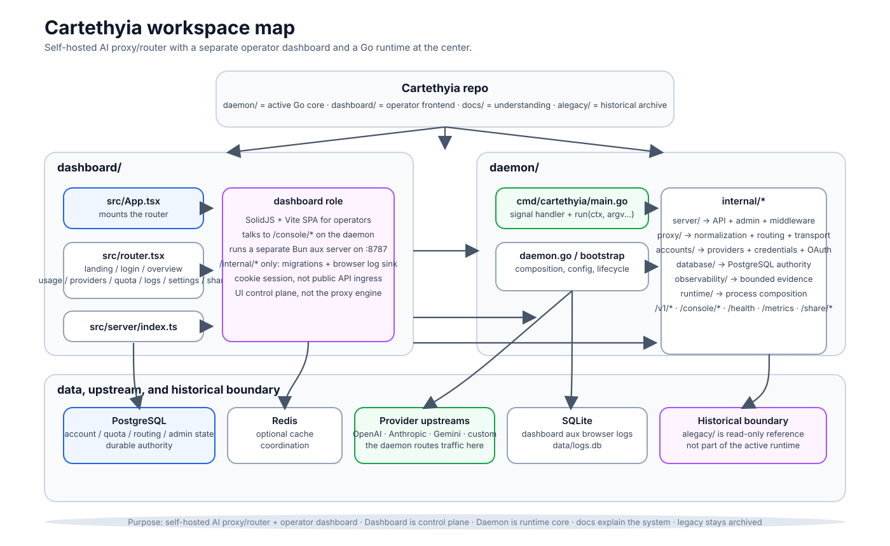

# Cartethyia Workspace Map

> Ringkasan visual workspace aktif: repo root, dashboard, daemon, docs, dan
> arsip legacy. Tujuannya supaya cepat paham apa yang dikerjakan program ini
> dan dari mana alur operasionalnya masuk.

## Mermaid source

```mermaid
flowchart TB
  Root["Cartethyia repo\nself-hosted AI proxy/router + admin dashboard"]

  subgraph Active["Active runtime"]
    Browser["Operator browser"]
    Client["External client\nSDK / CLI / IDE / app"]
    Dashboard["Dashboard SPA\nSolidJS + Vite"]
    Daemon["Go daemon\n:12800\n/v1/* /console/* /health /metrics /share/*"]
    Upstream["Provider upstream\nOpenAI / Anthropic / Gemini / custom"]
    DB["PostgreSQL\naccount / routing / quota / admin state"]
    Redis["Redis\noptional cache / coordination"]

    Browser -->|/console/*| Dashboard
    Client -->|/v1/*| Daemon
    Dashboard -->|cookie session + JSON| Daemon
    Dashboard -->|browser errors| Daemon
    Daemon --> Upstream
    Daemon --> DB
    Daemon --> Redis
  end

  subgraph DaemonInternals["router/"]
    Main["cmd/cartethyia/main.go\nsignal handler + run(ctx, argv...)"]
    Runtime["daemon.go / runtime bootstrap"]
    Server["internal/server/\nAPI + admin + middleware"]
    Proxy["internal/proxy/\nnormalization + routing + transport"]
    Accounts["internal/accounts/\nproviders + credentials + OAuth"]
    Data["internal/storage/\nPostgreSQL authority"]
    Obs["internal/observability/\nbounded lifecycle evidence"]

    Main --> Runtime --> Server
    Server --> Proxy
    Server --> Accounts
    Proxy --> Accounts
    Accounts --> Data
    Server --> Obs
    Proxy --> Obs
  end

  subgraph DashboardInternals["dashboard/"]
    App["src/App.tsx\n<Router />"]
    Router["src/router.tsx\nlanding / login / overview / usage / providers / quota / logs / settings / share"]
    Lib["src/lib/*\nconsole API + routing helpers"]
    Pages["src/pages/*\noperator screens"]

    App --> Router
    Router --> Pages
    Router --> Lib
  end

  subgraph History["Historical reference only"]
    Legacy["alegacy/\nread-only migration archive"]
  end

  Root --> Active
  Root --> DaemonInternals
  Root --> DashboardInternals
  Root --> History
```

## Membaca peta ini

- **Client eksternal** masuk ke **daemon** lewat `/v1/*`.
- **Operator** masuk ke **dashboard** lewat `/console/*`.
- **Dashboard** bukan mesin routing; ia hanya UI control plane yang berbicara ke daemon.
- **Daemon** adalah pusat kerja: auth, provider registry, routing, storage, proxy, dan observability.
- **`dashboard/src/lib/error-reporter.ts`** mengirim error browser langsung ke `POST /console/client-errors` di daemon.
- **`alegacy/`** hanya arsip historis; tidak menjadi runtime aktif.

## Entry points yang paling penting

- `router/cmd/cartethyia/main.go` — proses Go dimulai dari sini.
- `dashboard/src/App.tsx` — frontend dashboard masuk ke router dari sini.
- `dashboard/src/lib/error-reporter.ts` — browser error reporter dashboard dimulai dari sini.

## Inti produk

Cartethyia adalah **self-hosted AI proxy/router** dengan **dashboard operator**.
Produk ini ingin memisahkan:

1. **Surface client** — request model dari aplikasi eksternal.
2. **Control plane** — dashboard untuk operator.
3. **Runtime** — daemon yang memilih provider, account, proxy, dan storage.
4. **State durable** — PostgreSQL dan cache/coordination yang sesuai.

Semua keputusan desain di repo ini berputar di pemisahan empat lapis itu.
