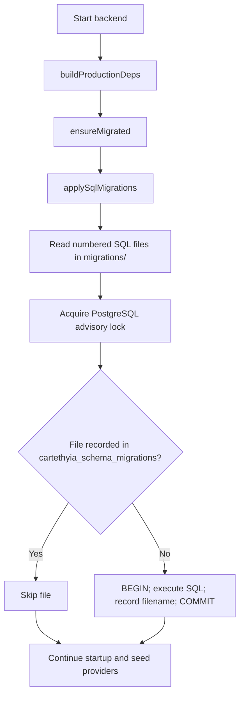

# Database migrations

This directory is the **tracked source of truth for executable SQL migrations**. The backend runs migrations automatically during startup; operators do not choose files or run SQL manually.

## Current state

- `0000_baseline.sql` declares the complete current schema for a new database, including types, tables, constraints, and indexes. Keep it aligned with `src/persistence/schema.ts`. It is the baseline a fresh install starts from, so it always describes the *current* shape — a schema change edits it and adds a forward migration beside it.
- `0001_*.sql` and later are **forward migrations**: the change needed by a database that already recorded an earlier file. They are applied in filename order after the baseline, so a fresh database runs the baseline and then converges through them.
- `src/persistence/postgres.ts` resolves this directory relative to the process working directory, reads only top-level `NNNN_*.sql` files in filename order, and applies each file transactionally under a cross-process advisory lock. Successful filenames are stored in `cartethyia_schema_migrations`. A migration failure aborts startup; a failed transaction does not record its filename.
- `src/runtime/dependencies.ts` calls `ensureMigrated()` before provider/catalog seeding. `src/persistence/readiness.ts` checks that every shipped filename is recorded before reporting ready.
- The Docker image copies this directory to `/app/migrations` (`Dockerfile`); `bun run start` runs the compiled binary with this repository as its working directory (`scripts/ops-start-binary.ts`). Both read the same committed SQL, with no generated staging copy.

## Next schema change

1. Change `src/persistence/schema.ts` and fold the complete new shape into `0000_baseline.sql` for fresh installations.
2. Add `0001_<description>.sql` **beside the baseline** with only the forward change needed by databases that already recorded `0000_baseline.sql`. Subsequent changes use `0002_...`, `0003_...`, and so on. Never put runnable SQL in a `manual/` subdirectory: the runner is non-recursive.
3. Make each forward migration safe to retry where possible (for example, `ADD COLUMN IF NOT EXISTS`), and do not edit an already-shipped forward migration to change what a ledger entry means.
4. Update this README and `src/persistence/PERSISTENCE.md` when the migration flow or schema policy changes; update `test/contracts/migration-integrity.contract.test.ts` and verify a fresh schema with `test/integration/isolated-db.test.ts`. Run `bun run typecheck` and the affected tests.

The baseline is for **new** databases. Editing it cannot upgrade a database that already recorded its filename; that is why every later schema change needs the corresponding numbered forward SQL file. The runner will apply that file at the next backend startup, before serving requests.
